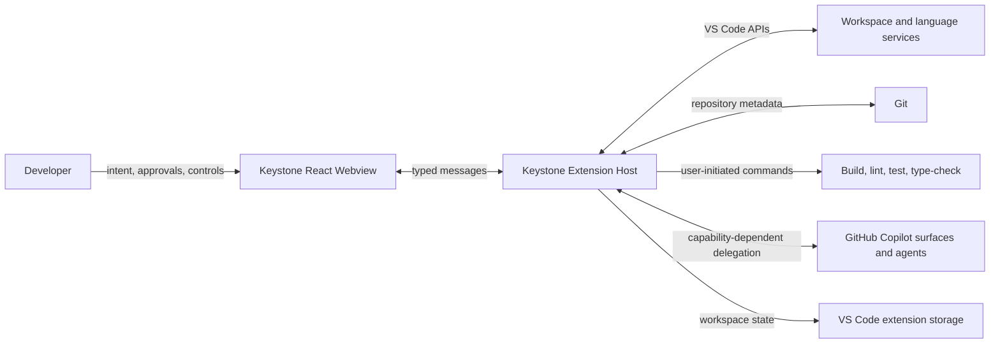
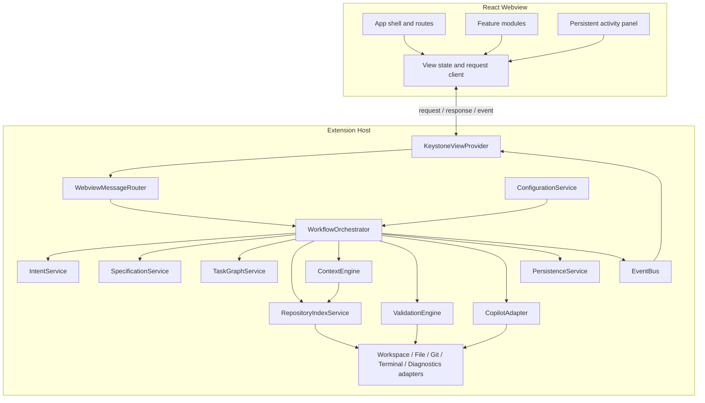
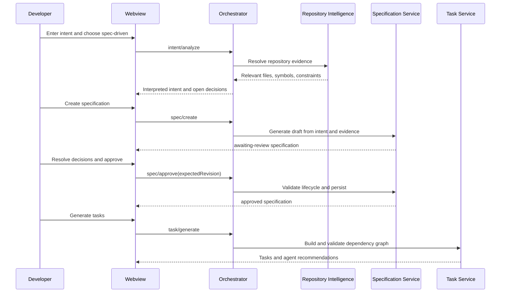

# Architecture

## 1. Architectural drivers

1. Keystone is one VS Code extension repository and one deployed extension package.
2. Repository access, Git, persistence, terminals, indexing, validation, and Copilot integration are trusted Extension Host operations.
3. The React Webview is an untrusted presentation boundary and never accesses the repository directly.
4. Repository intelligence is local and primarily deterministic; LLM use is optional enrichment, never a basic indexing dependency.
5. Copilot capabilities are runtime-discovered and isolated behind an adapter.
6. Workflow state must survive Webview and VS Code lifecycle events.
7. Every automated action is visible, inspectable, controllable, and attributable.

## 2. System context



Trust boundary: only the Extension Host can reach workspace, Git, commands, storage, or Copilot. The Webview receives serializable view models and issues validated requests.

## 3. Runtime containers

### 3.1 Extension Host

Owns:

- activation and command registration;
- Webview creation, lifecycle, CSP, and message routing;
- workspace/file/Git/language-service adapters;
- repository index and incremental updates;
- intent, specification, task, context, and validation services;
- Copilot capability discovery and delegation;
- local persistence and migration;
- terminal command policy and execution;
- structured logs and errors.

### 3.2 React Webview

Owns:

- navigation and route-level views;
- editors, lists, graphs, previews, progress, and settings forms;
- local ephemeral interaction state;
- request correlation and optimistic-state indicators;
- accessible rendering with VS Code theme tokens.

Does not own authoritative workflow state. After reconnection it replaces cached domain state with the Extension Host bootstrap snapshot.

## 4. Component model



### 4.1 Dependency rules

- `ui` may import shared contracts and UI modules only.
- `extension` may import core services, adapters, and shared contracts.
- `core` may import shared contracts and core abstractions; it may not import React or Webview code.
- VS Code-specific APIs appear only in the extension/adapters/persistence integration layer. Core domain logic receives interfaces.
- Copilot commands or proposed APIs appear only inside `CopilotAdapter` implementations.
- Persistence serializes domain records; persisted representations never contain live VS Code objects.
- Shared contracts contain JSON-serializable types and runtime schemas, not business services.

## 5. Suggested repository structure

```text
keystone/
├── package.json
├── tsconfig.json
├── vite.config.ts
├── eslint.config.js
├── src/
│   ├── extension/
│   │   ├── extension.ts
│   │   ├── activation.ts
│   │   ├── commands.ts
│   │   ├── webview/
│   │   └── vscode/
│   ├── core/
│   │   ├── intent/
│   │   ├── specifications/
│   │   ├── tasks/
│   │   ├── intelligence/
│   │   ├── context/
│   │   ├── validation/
│   │   ├── copilot/
│   │   ├── persistence/
│   │   ├── events/
│   │   └── configuration/
│   ├── ui/
│   │   ├── routes/
│   │   ├── features/
│   │   ├── components/
│   │   ├── hooks/
│   │   ├── state/
│   │   ├── services/
│   │   └── styles/
│   └── shared/
│       ├── contracts/
│       ├── schemas/
│       ├── errors/
│       ├── logging/
│       └── utilities/
├── tests/
│   ├── unit/
│   ├── integration/
│   ├── extension/
│   └── ui/
├── resources/
└── docs/
```

These are internal boundaries, not packages or deployment units.

## 6. Activation and lifecycle

1. Activation registers commands, Activity Bar view, configuration listeners, and lightweight service factories.
2. It does not index on the activation path.
3. Opening the view creates the Webview with a strict CSP and local-resource roots restricted to built UI assets.
4. The Webview sends `app/bootstrap`; the Extension Host returns configuration, repository/index status, agents, active workflow, and recent activities.
5. If enabled, indexing starts after the UI is available. Progress is streamed as events.
6. File watchers are registered only for active workspaces and disposed with the extension.
7. Every material workflow transition is persisted before its success event is sent.
8. When the Webview is disposed, host operations continue only when the VS Code API permits and remain cancellable through commands; no work runs outside active VS Code.
9. On reload, persisted `executing` states become `awaiting-user` or `blocked` unless the adapter can prove a resumable execution handle.

## 7. Webview communication

### 7.1 Envelope

Every message contains:

```ts
interface MessageEnvelope<TType extends string, TPayload> {
  requestId: string;
  type: TType;
  timestamp: string;
  schemaVersion: number;
  payload: TPayload;
}
```

The receiver validates envelope and payload at runtime. Unknown versions or message types receive a structured `WEBVIEW_SCHEMA_UNSUPPORTED` error and are never executed.

### 7.2 Request semantics

- Requests are idempotent when their operation can safely be retried. Mutation requests include an expected entity revision.
- Responses use the same request ID and contain either typed data or a `KeystoneError`.
- Domain events use independent event IDs and monotonic entity revisions.
- Duplicate request IDs return the cached prior result within a bounded window.
- A Webview reconnection always begins with a full bootstrap snapshot; subsequent events are deltas.
- Payloads contain view models and references, never unrestricted file contents unless explicitly requested for an approved preview.

### 7.3 Initial message families

| Family | Requests | Events |
|---|---|---|
| App | `app/bootstrap` | `app/stateChanged` |
| Index | `index/start`, `index/cancel`, `index/search` | `index/progress`, `index/updated`, `index/error` |
| Intent | `intent/analyze`, `intent/update` | `intent/updated` |
| Specification | `spec/create`, `spec/update`, `spec/approve`, `spec/revise` | `spec/updated`, `spec/approvalRequired` |
| Agent | `agent/list`, `agent/assign` | `agent/availabilityChanged` |
| Task | `task/generate`, `task/delegate`, `task/control` | `task/updated`, `task/stale` |
| Context | `context/preview`, `context/pin`, `context/exclude` | `context/updated` |
| Validation | `validation/plan`, `validation/run`, `validation/override` | `validation/progress`, `validation/updated` |

## 8. Orchestration flows

### 8.1 Spec-driven flow



### 8.2 Delegation flow

1. Confirm the task is ready, its specification revision is approved, and its context fingerprint is current.
2. Resolve the assigned agent against current capabilities.
3. Build a context package within budget and secret policy.
4. Show task, agent, files, criteria, context, estimated size, and expected output.
5. On explicit delegation, persist `delegating` before invoking the adapter.
6. Use direct delegation only if a supported API returns a real execution handle.
7. Otherwise run assisted delegation and persist `awaiting-user`/`externally-executing` semantics.
8. Detect repository changes and supported completion signals; never infer completion from elapsed time.
9. Require user confirmation or result import where the integration cannot supply authoritative completion.
10. Move to validation only after outputs are identified.

## 9. Persistence architecture

| Data | Location | Notes |
|---|---|---|
| Active workflows, specs, revisions, task history, validation | VS Code workspace storage | Default; scoped to workspace identity |
| Agent aliases and user-wide preferences | VS Code global storage | No credentials |
| Repository index and summary cache | Extension-managed workspace storage | Branch- and fingerprint-aware |
| Logs | Extension output channel plus bounded extension storage | Redacted; correlation IDs |
| Repository-visible specifications | Workspace files only when enabled | Atomic writes and explicit user setting |

Persistence uses versioned snapshots plus an append-only bounded transition journal for recovery and audit. Writes use temporary data plus atomic replacement where filesystem storage is used. Migrations are forward-only and preserve a backup until a new version loads successfully.

## 10. Security design

- Webview CSP defaults to `default-src 'none'`; scripts use a per-render nonce; styles and fonts are restricted to the Webview origin and necessary VS Code sources.
- `enableCommandUris` is false unless a narrowly scoped feature proves it necessary.
- HTML derived from user/repository content is rendered as text or passed through an allowlist sanitizer.
- Every Webview request is schema-validated, authorized against current state, and size-limited.
- File access resolves canonical paths and rejects traversal or resources outside workspace roots.
- Ignore and secret policy is applied before reads used for indexing or context.
- Context transmission requires a user-initiated delegation and a visible preview fingerprint.
- GitHub/Copilot credentials are owned by GitHub extensions; Keystone neither requests nor persists them.
- Validation commands come from detected/configured allowlists. Shell metacharacters, destructive tools, elevation, network publishing, and unrecognized commands require confirmation or are rejected.
- Logs redact environment values, credential-shaped strings, and file content by default.

## 11. Performance design

- Activation constructs no index and reads only small configuration/state metadata.
- Index stages are queued and cancellable: metadata → structure → symbols → relationships → tests → framework intelligence.
- Files are streamed, fingerprinted, and parsed under concurrency limits; contents are released after extraction.
- Caches have byte/item limits and least-recently-used eviction.
- File-system events use a 300–750 ms adaptive debounce and collapse repeated changes by URI.
- Large repositories use priority indexing: open/mentioned files, manifests, entry points, source, tests, then lower-value files.
- Webview events are throttled; progress updates are coalesced to avoid render storms.
- CPU-heavy parsers run off the UI path and yield between batches; unsupported parsers degrade to metadata-only entries.

## 12. Error architecture

All errors contain code, safe message, technical details, operation, recoverability, recommended action, retry capability, correlation ID, and optional cause. Error categories are workspace, indexing, parsing, persistence, Copilot, agent, context, validation, terminal, Webview, and configuration.

Errors affect the smallest possible scope. A single parse failure becomes an index warning; an unavailable agent blocks delegation for that task; corrupt persisted state enters recovery mode without deleting the original data.

