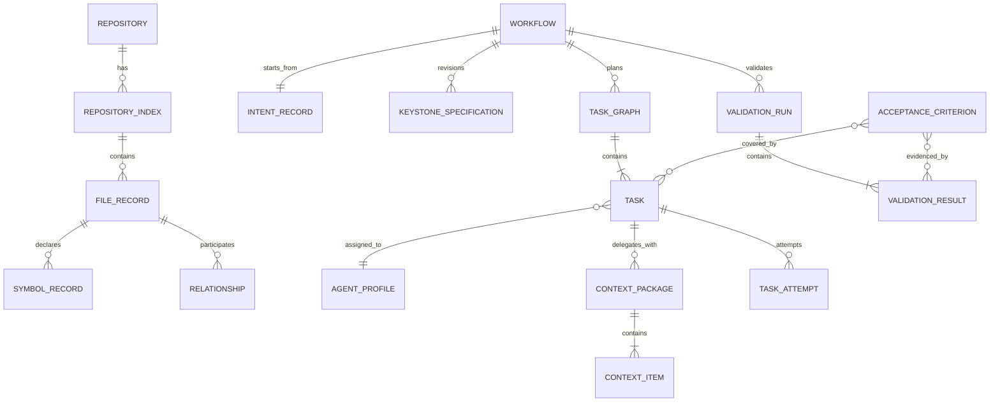
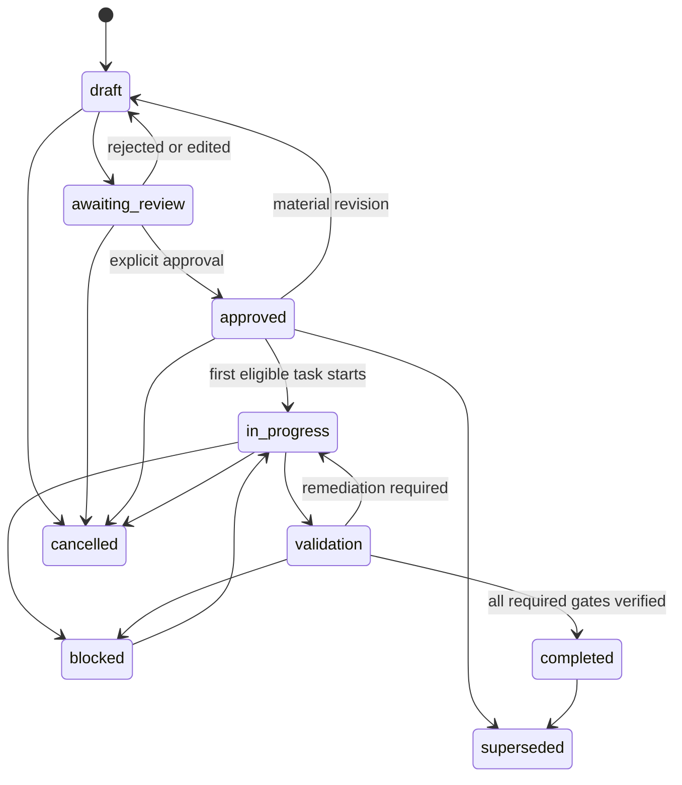
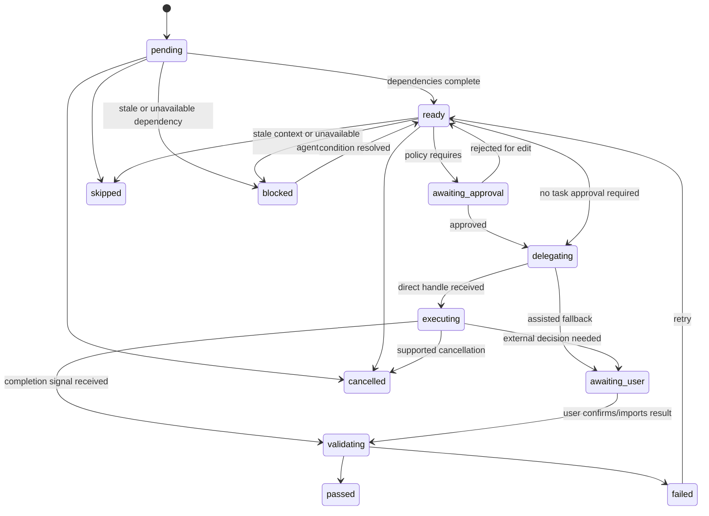

# Data model and lifecycle

## 1. Conventions

- IDs are opaque, stable UUIDs except human-facing specification labels such as `KS-1042`.
- Timestamps are UTC ISO 8601 strings.
- Every mutable aggregate has an integer `revision` incremented on each persisted mutation.
- References use IDs, not embedded mutable aggregates, unless the object is an immutable snapshot.
- Persisted records contain `schemaVersion`.
- Deleted user records use tombstones while referenced by history; caches may be evicted outright.
- File paths are normalized workspace-relative POSIX paths plus a workspace-root ID. Absolute paths are not sent to the Webview unless needed for a local display action.

## 2. Aggregate relationships



## 3. Repository records

### `RepositoryIdentity`

| Field | Type | Constraint |
|---|---|---|
| `id` | string | Stable hash of canonical workspace roots and Git remote identity when available |
| `displayName` | string | Non-empty |
| `workspaceRoots` | root reference[] | One or more; MVP intelligence is one repository/workspace scope |
| `gitRoot` | path reference? | Optional for non-Git workspaces |
| `branch` | string? | Current branch or detached marker |
| `headCommit` | string? | Commit hash when available |

### `RepositoryIndex`

| Field | Type | Constraint |
|---|---|---|
| `id`, `repositoryId` | string | Required |
| `branchKey` | string | Branch plus base commit/fingerprint |
| `status` | index state | Required |
| `startedAt`, `completedAt` | timestamp? | Completion is absent while running |
| `indexVersion` | number | Incremented for every committed update |
| `files` | `FileRecord` references | Bounded/load-on-demand in UI |
| `relationships` | `Relationship` references | Typed graph edges |
| `commands` | `ProjectCommand`[] | Detected plus configured provenance |
| `frameworks` | `FrameworkSignal`[] | Includes confidence/evidence |
| `errors` | structured warning[] | Bounded |

Index states: `idle`, `scanning`, `extracting-symbols`, `building-relationships`, `ready`, `partial`, `cancelled`, `failed`, `stale`.

### `FileRecord`

Required fields: workspace root ID, relative path, language, category, byte size, modification time, fingerprint, generated/binary/secret/excluded flags, parse support, symbol IDs, import/export targets, test mapping IDs, and last-indexed time.

Invariant: excluded, binary, and secret-like files may retain only policy-safe metadata and must not retain content-derived summaries.

### `SymbolRecord`

Required fields: ID, name, kind, file ID, declaration range, exported visibility, container ID, signature, documentation summary if locally extractable, and parser source. Symbol IDs are deterministic within a file fingerprint so unchanged symbols remain reusable.

### `Relationship`

Kinds: `imports`, `exports`, `references`, `calls`, `inherits`, `implements`, `routes-to`, `tests`, `configures`, and `depends-on`. Every edge includes source, target, confidence, evidence location, and extraction method. Low-confidence relationships inform ranking but are not presented as certain.

## 4. Intent aggregate

### `IntentRecord`

| Field | Notes |
|---|---|
| `id`, `workflowId`, `revision` | Identity and concurrency control |
| `originalText` | Immutable user input for this revision |
| `normalizedObjective` | Concise implementation objective |
| `category` | Feature, bug fix, refactor, testing, investigation, modernization, performance, security, documentation, review, maintenance |
| `developmentMode` | `quick`, `guided`, `spec-driven` |
| `affectedAreas` | Ranked file/module/symbol references with reasons |
| `expectedOutcome` | User-visible or engineering result |
| `constraints` | Explicit plus repository-derived, with provenance |
| `ambiguities` | Open questions and impact |
| `riskLevel` | `low`, `medium`, `high`, `critical` |
| `recommendedWorkflow` | Mode and approval policy |
| `recommendedAgents` | Capability-ranked agent IDs with reasons |
| `requiredDecisions` | Blocking or non-blocking user choices |

Invariant: original text is never overwritten by normalization. A new user edit creates an intent revision.

## 5. Specification aggregate

### `KeystoneSpecification`

Identity includes ID, title, lifecycle status, revision, created/updated timestamps, repository identity, branch, and base commit/index version.

Sections:

- intent: original request, normalized intent, business objective, outcome;
- scope: included/excluded functionality, modules, expected files/components, dependencies;
- existing behavior: implementation summary, architecture, constraints, known limitations, evidence references;
- proposed behavior: functional/non-functional requirements, user flows, interfaces, models, errors;
- engineering constraints: conventions, frameworks, dependencies, security, performance, compatibility, protected areas;
- criteria: `AcceptanceCriterion[]`;
- test strategy: existing/new tests, impacted suites, manual and negative scenarios, regression risks;
- implementation plan: task graph reference and plan revision;
- decision log: questions, decisions, assumptions, rejected approaches, revisions.

### `SpecificationRevision`

Stores specification ID, revision number, complete immutable snapshot, previous revision, changed section paths, semantic change class (`editorial`, `clarification`, `material`), impacted task IDs, author, reason, and approval record.

Material changes include scope, required behavior, required criteria, protected constraints, interface/data model, task outputs, or validation obligations. Material revisions invalidate approval and mark affected active tasks stale.

### Specification state machine



Invariant: `approved → in-progress` is the sole normal implementation entry. `completed` requires all required criteria passed or an explicit override record.

## 6. Acceptance criterion

`AcceptanceCriterion` fields:

- ID unique inside specification revision;
- testable description;
- `required: boolean`;
- source requirement IDs;
- validation method and expected evidence type;
- covering task IDs;
- current result (`unverified`, `passed`, `failed`, `requires-user-review`, `overridden`);
- evidence references;
- override decision ID when applicable.

Invariant: every required criterion has at least one covering task and one validation method before approval.

## 7. Task graph aggregate

### `TaskGraph`

Fields: ID, workflow/specification ID and revision, graph revision, task IDs, generated time, generation provenance, validation status, and topological ordering. A graph with missing dependency targets or cycles cannot be approved.

### `Task`

| Field | Constraint |
|---|---|
| `id`, `title`, `objective`, `description` | Required |
| `status` | Valid task state |
| `dependencies` | Existing task IDs; acyclic |
| `assignedAgentId` | Resolves to a current/configured agent before delegation |
| `requiredContextPolicy` | Selection seeds, budget, mandatory/excluded items |
| `expectedFiles` | May be patterns before exploration; becomes concrete before implementation |
| `expectedOutput` | Testable description |
| `acceptanceCriterionIds` | At least one for implementation/validation tasks |
| `validationSteps` | Commands or manual checks with policy class |
| `retryHistory` | Immutable attempt references |
| `executionNotes` | Timestamped, attributed entries |
| `baseFingerprint` | Spec revision, index version, Git base, context fingerprint |

### Task state machine



Skipping a task does not satisfy dependents automatically. The user must confirm dependency bypass and affected criteria; Keystone records the decision.

## 8. Agent model

`AgentProfile` fields: agent ID, display name, description, source, availability, supported task categories, tools/actions, repository-access expectations, strengths, restrictions, default context policy, discovery timestamp, and capability fingerprint.

Availability is `available`, `configured`, `unavailable`, or `unknown`. A configured Keystone profile is not represented as a directly invokable Copilot agent unless discovery proves invocation support.

`AgentAssignment` records selection mode, task/workflow ID, agent ID, recommendation candidates and reasons, user confirmation, timestamp, and capability fingerprint.

## 9. Context model

### `ContextPackage`

Fields: ID, task ID, specification revision, repository index version, base commit, created time, selection-policy version, budget, estimated tokens/bytes, items, excluded candidates with reasons, package fingerprint, review status, reviewed time, and delegation attempt ID.

### `ContextItem`

Kinds: objective, specification section, criterion, convention, symbol summary, code range, file, dependency interface, related test, configuration, prior task output, constraint, validation command.

Each item records source reference/fingerprint, selection reason, rank score components, compression form, estimated size, mandatory/pinned flag, inclusion status, and exclusion reason.

Invariant: delegation uses the exact reviewed package fingerprint. If any source fingerprint changes, the package becomes stale and requires regeneration/review.

## 10. Execution and validation

### `TaskAttempt`

Fields: attempt number, task ID, agent assignment snapshot, context package ID/fingerprint, delegation method (`direct`, `assisted`), timestamps, external handle if supported, state, result references, observed Git/file changes, user confirmations, and failure/error record.

### `ValidationRun`

Fields: ID, workflow/spec revision, task IDs, repository base/result commits or snapshots, start/end, status, checks, changed-file set, criterion results, drift findings, and override records.

### `ValidationResult`

Fields: check ID/type, status, command or review method, start/end, exit code, bounded/redacted output reference, evidence references, affected criteria, retryability, and error.

### `OverrideRecord`

Required when bypassing failed/unverified criteria or dangerous-command policy. It records user, time, precise item, reason, risk acknowledgement, prior result, and resulting status. Overrides are visible in the completion report.

## 11. Workflow aggregate

`Workflow` is the recovery root. It references repository identity, active intent revision, active specification revision, task graph, active task/attempt, validation runs, UI resume route, activity summary, created/updated times, and workflow status.

Workflow states: `drafting`, `awaiting-spec-approval`, `planned`, `executing`, `awaiting-user`, `blocked`, `validating`, `completed`, `cancelled`.

The workflow state is derived from its aggregates but persisted for fast bootstrap. On load, the persistence service verifies the derived state and repairs only safe inconsistencies; otherwise it enters recovery mode.

## 12. Persistence keys and migrations

Suggested workspace storage partitions:

```text
keystone/meta
keystone/workflows/<workflow-id>
keystone/specifications/<spec-id>/<revision>
keystone/task-graphs/<graph-id>
keystone/attempts/<attempt-id>
keystone/validation/<run-id>
keystone/index/<repository-id>/<branch-key>/<shard>
keystone/journal/<workspace-id>
```

Large index data is sharded and loaded on demand. Workflow/spec/task writes are transactional at the service layer: validate → append transition → persist aggregate → publish event. If persistence fails, no success event is published.

Migration procedure:

1. Read metadata and schema version.
2. Validate source record and preserve a backup marker.
3. Run deterministic forward migrations.
4. Validate target records and invariants.
5. Atomically update version metadata.
6. Retain bounded migration diagnostics; never silently discard corrupt user workflow data.

