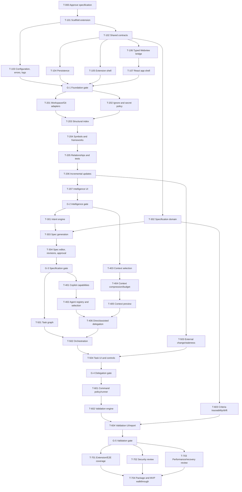

# Implementation plan

## Current 16-milestone progression

1. Repository Intelligence foundation
2. Continuous ingestion
3. Semantic graph
4. Progressive CPG
5. Repository adapters
6. Query and analysis engine
7. OKF projection
8. Complete Intelligence UI and hardening
9. Intent capture and specification workflow
10. Copilot agent discovery, context construction, and controlled delegation
11. Execution tracking, validation, retry, and completion
12. Git and PR delivery
13. Task Handoff and team workflow
14. AI-driven SDLC orchestration
15. Product integration and end-to-end hardening
16. Release readiness and pilot validation

Four milestones remain incomplete: 7, 8, 15, and 16. Production Observability and Incident Intelligence is optional post-pilot work, not a critical-path phase. The task IDs below remain the detailed implementation graph for their applicable milestones; `PLANS.md` is the live status authority.

## 1. Execution policy

This plan becomes executable only after `KEYSTONE-SPEC-001` is approved. Tasks execute in dependency order. A task may start only when:

- all dependencies have passed or an explicit dependency-bypass decision exists;
- the active specification revision is approved;
- its expected output and validation are still current;
- its assigned agent is available/configured;
- its context package has been reviewed when implementation is delegated.

Parallel work is permitted only when dependency and expected-file overlap analysis shows no conflict. Phase gates are not optional.

## Current progress

| Item | Status | Evidence |
|---|---|---|
| T-000 Specification approval | Completed | Revision 1 approved on 2026-07-14 |
| T-101–T-107 Foundation tasks | Completed | Type-check, lint, 12 unit/UI tests, production bundles, and VS Code 1.95 Extension Host smoke test pass |
| G-1 Foundation gate | Passed | Reload-safe store, runtime-validated bridge, strict Webview asset boundary, Activity Bar shell, and 172 KB installable VSIX |
| T-201 Workspace/Git adapters | Next | Phase 2 repository-intelligence implementation |

Foundation deliverable: `keystone-0.1.0.vsix`. Unimplemented sections remain visibly unavailable; no Copilot, repository-index, or execution capability is simulated in the production build.

## 2. Agent roles

Agent IDs below are capability roles, resolved to available Copilot agents/profiles at execution time.

| Role | Responsibilities |
|---|---|
| `planning` | Architecture, contracts, decomposition, decisions |
| `coding` | Extension/core/UI implementation |
| `testing` | Unit, integration, extension, and UI tests |
| `security-review` | Webview boundary, secrets, command policy, path safety |
| `quality-review` | Requirement traceability, regressions, performance, completion review |

If only a general coding agent is available, it may fill a role after explicit confirmation; the role-specific validation remains unchanged.

## 3. Task graph



## 4. Phase 0 — specification approval

### T-000: Review and approve the specification

- **Agent:** `planning`
- **Dependencies:** none
- **Outputs:** resolved/deferred open decisions; signed approval record; specification status `approved`
- **Validation:** document-link check; requirement/task/criterion traceability audit; no blocking open decision
- **Gate:** no implementation before completion

## 5. Phase 1 — extension foundation

### T-101: Scaffold the single extension project

- **Agent:** `coding`
- **Dependencies:** T-000
- **Outputs:** package manifest, TypeScript/build/lint/test configuration, single-repository directory structure, packaging scripts
- **Validation:** clean install; production build; VSIX packaging; no monorepo/workspace package boundary

### T-102: Implement shared contracts and runtime schemas

- **Agent:** `coding`
- **Dependencies:** T-101
- **Outputs:** versioned entities, request/response/event envelopes, runtime validators, schema fixtures
- **Validation:** compile-time exhaustive unions; valid/invalid/unknown-version schema tests

### T-103: Implement configuration, structured errors, and logging

- **Agent:** `coding`
- **Dependencies:** T-101
- **Outputs:** documented settings/defaults, resolution layers, redacted logger/output channel, error taxonomy and correlation
- **Validation:** configuration precedence and malformed-value tests; redaction tests

### T-104: Implement local persistence and migrations

- **Agent:** `coding`
- **Dependencies:** T-102, T-103
- **Outputs:** workspace/global/index stores, versioned snapshots, transition journal, migrations, recovery behavior
- **Validation:** round-trip, reload, partial-write, corrupt-data, migration, and repository-non-modification tests

### T-105: Implement activation, commands, and Activity Bar shell

- **Agent:** `coding`
- **Dependencies:** T-102, T-103
- **Outputs:** lazy activation, command registration, view provider, disposables/lifecycle
- **Validation:** VS Code extension tests for activation, command/view registration, and under-500-ms path excluding indexing

### T-106: Implement secure typed Webview bridge

- **Agent:** `coding`
- **Dependencies:** T-102, T-103, T-105
- **Outputs:** CSP/nonce HTML, constrained resources, message router, correlation/idempotency, bootstrap/events
- **Validation:** CSP inspection; traversal/unknown-message/oversize/duplicate-request tests

### T-107: Implement React app shell and activity panel

- **Agent:** `coding`
- **Dependencies:** T-106
- **Outputs:** Vite React SPA, eight primary routes, host client/state bootstrap, responsive VS Code-themed navigation, persistent activity panel, accessible primitives
- **Validation:** Webview load under target, navigation/keyboard/theme/reconnection UI tests

### G-1: Foundation gate

All phase tasks pass; reload restores a sample workflow; Webview cannot access repository APIs; packaging contains built assets only.

## 6. Phase 2 — repository intelligence

### T-201: Workspace, filesystem, Git, and language-service adapters

- **Agent:** `coding`
- **Dependencies:** G-1
- **Outputs:** testable interfaces/VS Code implementations, workspace identity, branch/HEAD observation
- **Validation:** multi-root behavior, non-Git workspace, branch change, adapter contract tests

### T-202: Ignore, generated, binary, size, and secret policy

- **Agent:** `security-review`
- **Dependencies:** G-1
- **Outputs:** deny-first policy engine, ignore-source merger, classifiers, redacted decisions
- **Validation:** fixtures for nested ignore rules, path normalization, secrets, binaries, generated/vendor/oversized content

### T-203: Structural scanner and index persistence

- **Agent:** `coding`
- **Dependencies:** T-201, T-202
- **Outputs:** cancellable staged scanner, file/language/category records, fingerprints, sharded index
- **Validation:** cancellation at every stage, 25k-file fixture, partial failure, bounded memory

### T-204: Symbol, manifest, command, entry-point, and framework extraction

- **Agent:** `coding`
- **Dependencies:** T-203
- **Outputs:** symbol adapter, package/config detectors, supported-language baseline, confidence/evidence
- **Validation:** TypeScript/JavaScript fixture plus approved secondary-language fixtures; unsupported language fallback

### T-205: Relationship graph and test mapping

- **Agent:** `coding`
- **Dependencies:** T-204
- **Outputs:** typed graph edges, bounded neighborhood queries, routes/endpoints where detectable, test mappings
- **Validation:** import/export/reference/inheritance and test-mapping fixtures; no unsupported inference

### T-206: Incremental updates and stale-context signals

- **Agent:** `coding`
- **Dependencies:** T-205
- **Outputs:** debounced watchers, create/change/delete/rename, affected-neighborhood refresh, branch cache reuse, index events
- **Validation:** one-file update avoids full rescan; task/context becomes stale only on relevant fingerprint changes

### T-207: Intelligence UI

- **Agent:** `coding`
- **Dependencies:** T-206, T-107
- **Outputs:** status/progress/cancel, overview, symbol/file search, dependency/test view, errors, re-index
- **Validation:** pagination, cancellation, partial index, empty/non-Git/large-repository UI states

### G-2: Intelligence gate

Indexing is local, cancellable, incremental, branch-aware, policy-compliant, observable, and recovers after reload.

## 7. Phase 3 — intent and specifications

### T-301: Intent analysis and modes

- **Agent:** `coding`
- **Dependencies:** G-2
- **Outputs:** `IntentRecord`, repository impact query, quick/guided/spec-driven outputs, ambiguity/risk/agent recommendations
- **Validation:** normalization preserves original; repo-known information is not re-asked; mode/category fixtures

### T-302: Specification domain and lifecycle

- **Agent:** `coding`
- **Dependencies:** T-102
- **Outputs:** specification/criterion/revision/decision models, transition guards, material-change classifier
- **Validation:** exhaustive lifecycle and invariant tests, including approval invalidation

### T-303: Repository-aware specification generation

- **Agent:** `coding`
- **Dependencies:** T-301, T-302
- **Outputs:** all required sections, evidence links, traceable criteria, test strategy, open decisions; capability-based Copilot enrichment plus deterministic fallback
- **Validation:** every spec section present; no fabricated existing behavior; required criteria have method and planned coverage

### T-304: Specification editor, diff, decisions, and approval

- **Agent:** `coding`
- **Dependencies:** T-303, T-104, T-107
- **Outputs:** list/editor, revision diff, criteria/decision editing, approve/reject/revise controls, optional workspace-visible export
- **Validation:** material revision requires reapproval and marks affected tasks stale; default creates no repository file

### G-3: Specification gate

The canonical spec-driven scenario reaches `approved`; unapproved work cannot generate delegable implementation tasks.

## 8. Phase 4 — agents, context, and delegation

### T-401: Copilot capability adapter

- **Agent:** `coding`
- **Dependencies:** G-3
- **Outputs:** adapter contract, runtime discovery, capability fingerprints, version isolation, degradation errors
- **Validation:** all nine contract cases in `05-copilot-integration.md`

### T-402: Agent registry, recommendation, rules, and assignments

- **Agent:** `coding`
- **Dependencies:** T-401
- **Outputs:** discovery/profile/alias merge, availability UI model, four selection modes, per-task assignment
- **Validation:** eligibility/ranking reasons, unavailable/incompatible agent behavior, no configured-vs-available conflation

### T-403: Deterministic context candidate selection

- **Agent:** `coding`
- **Dependencies:** G-2, T-301
- **Outputs:** seed extraction, graph queries, explainable scoring, deduplication, policy filtering
- **Validation:** deterministic ranking fixtures; every candidate has reasons and provenance

### T-404: Context compression, budgeting, cache, and fingerprinting

- **Agent:** `coding`
- **Dependencies:** T-403
- **Outputs:** structured representation selection, estimates, budget solver, bounded cache, stale detection
- **Validation:** large-file/symbol/interface/test fixtures; mandatory-over-budget blocks visibly

### T-405: Context preview and controls

- **Agent:** `coding`
- **Dependencies:** T-404, T-107
- **Outputs:** included/excluded groups, reasons, size, pin/remove/add/regenerate, review state
- **Validation:** any material edit invalidates review fingerprint; secret exclusions cannot be bypassed into transmission

### T-406: Direct and assisted delegation

- **Agent:** `coding`
- **Dependencies:** T-401, T-402, T-405
- **Outputs:** immutable delegation request, direct path, assisted UX, attempt tracking, import/confirmation, retry/reassignment
- **Validation:** no fabricated signals, exact reviewed fingerprint transfer, pre-existing vs new change classification

## 9. Phase 5 — task execution and continuity

### T-501: Task graph generation and validation

- **Agent:** `coding`
- **Dependencies:** G-3
- **Outputs:** tasks from specification, dependency/criterion links, cycle/missing-dependency checks, readiness calculation
- **Validation:** graph fixtures, overlapping-file conflict detection, deterministic eligible ordering

### T-502: Workflow orchestrator and execution controls

- **Agent:** `coding`
- **Dependencies:** T-501, T-406, T-104
- **Outputs:** task transitions, approval policy, pause/resume/skip/cancel/retry, persisted attempts, recovery
- **Validation:** exhaustive transition/concurrency/reload tests; unsupported external work is never falsely resumed

### T-503: External repository change and stale-base handling

- **Agent:** `coding`
- **Dependencies:** T-206, T-501
- **Outputs:** Git/file baselines, overlap detection, stale task/context events, pre-existing change preservation
- **Validation:** relevant/unrelated external changes, dirty repository baseline, branch switch during workflow

### T-504: Task graph/list UI and controls

- **Agent:** `coding`
- **Dependencies:** T-502, T-503, T-107
- **Outputs:** graph/list, dependencies, agent assignment, execution/activity, retry and control actions, expected/actual changes
- **Validation:** controls authorized by state, blocked reasons visible, no conflicting concurrent delegation by default

### G-4: Delegation gate

An approved specification can produce tasks, reviewed context, a supported/assisted attempt, observed changes, and reload-safe continuity.

## 10. Phase 6 — validation and completion

### T-601: Validation command detection and safety runner

- **Agent:** `security-review`
- **Dependencies:** G-4
- **Outputs:** detected/configured commands with provenance, allowlist/risk classification, confirmation, cancellation/timeouts, bounded/redacted output
- **Validation:** safe and dangerous command fixtures; injection/metacharacter/environment redaction tests

### T-602: Validation engine

- **Agent:** `coding`
- **Dependencies:** T-601
- **Outputs:** build/type/lint/tests, expected/unexpected files, TODO scan, security/performance hooks, result statuses/evidence
- **Validation:** pass/warn/fail/not-run/manual cases; partial and cancelled runs

### T-603: Criteria traceability and specification drift

- **Agent:** `quality-review`
- **Dependencies:** T-302, T-501, T-503
- **Outputs:** requirement → criterion → task → attempt → evidence map, drift findings, override model
- **Validation:** uncovered/failed/stale evidence blocks completion; overrides require rationale and remain visible

### T-604: Validation UI and completion report

- **Agent:** `coding`
- **Dependencies:** T-602, T-603, T-107
- **Outputs:** grouped results, changed-file review, criteria matrix, rerun/manual verify/override, completion report
- **Validation:** completion gate enforcement; report survives reload and identifies every exception

### G-5: Validation gate

All required criteria are passed/explicitly overridden with evidence; completion cannot be reached otherwise.

## 11. Phase 7 — release hardening

### T-701: Extension and end-to-end test coverage

- **Agent:** `testing`
- **Dependencies:** G-5
- **Outputs:** VS Code extension tests and canonical MVP scenario across reload
- **Validation:** clean environment execution on supported OS/VS Code matrix

### T-702: Security and privacy review

- **Agent:** `security-review`
- **Dependencies:** G-5
- **Outputs:** threat-model review, CSP/message/path/secret/command/Copilot audit, findings/remediation
- **Validation:** zero unresolved critical/high findings; medium findings explicitly accepted or remediated

### T-703: Performance, scale, cancellation, and recovery review

- **Agent:** `quality-review`
- **Dependencies:** G-5
- **Outputs:** activation/UI/index/memory measurements, large-repository run, cancellation/reload/failure-injection report
- **Validation:** NFR targets or approved deviations with evidence

### T-704: Package and demonstrate MVP

- **Agent:** `quality-review`
- **Dependencies:** T-701, T-702, T-703
- **Outputs:** reproducible VSIX, checksums, install instructions, canonical walkthrough, known limitations, release completion report
- **Validation:** install in clean VS Code profile and complete all 14 MVP success steps

## 12. Expected implementation order

The critical path is:

```text
T-000 → Foundation → Intelligence → Intent/Specifications
→ Copilot/Context + Task Graph → Orchestration → Validation → Hardening
```

Within phases, tests are written alongside each task. Test work is not deferred entirely to Phase 7; T-701 closes cross-component and extension-environment gaps.
