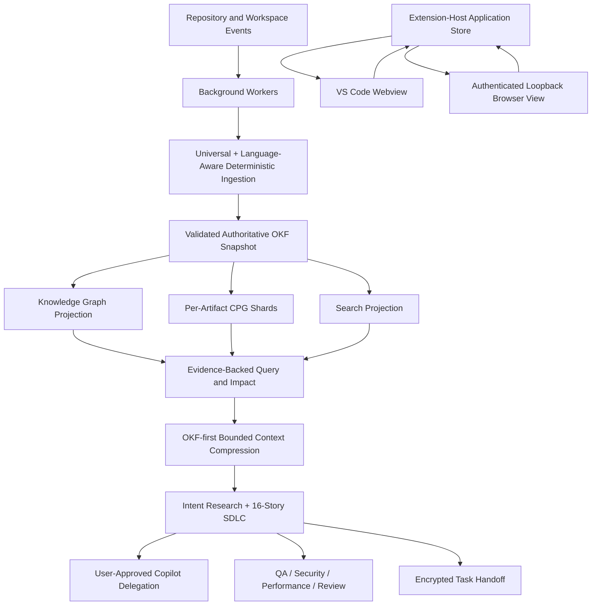

# Keystone Architecture

Keystone is one local-first VS Code extension. The extension host owns the workspace runtime, application state, intelligence workers, SDLC engine, Task Handoff, and Copilot delegation boundary. The same web application is rendered inside VS Code and through **Open Keystone in Browser**.

## Runtime ownership

- `src/extension/core/extension.ts` activates the extension.
- `src/extension/ui/vscodeProvider.ts` is the typed command bridge.
- `src/core/application/applicationStore.ts` owns synchronized UI state.
- `src/core/intelligence/` owns discovery, extraction, OKF, graph, CPG, query, impact, health, and persistence.
- `src/core/context/` owns intent-aware retrieval, ranking, deduplication, compression, and delegation packets.
- `src/core/workflow/sdlc/` owns the durable SDLC state machine.
- `src/core/workflow/handoff/` owns portable handoff contracts, redaction, integrity, and encryption.
- `src/extension/browser-view/` serves the same UI from a loopback-only authenticated session.

## State and command flow

The UI never owns authoritative product state. Both surfaces send typed commands to the extension host. The host validates commands, updates durable state, increments the state version, and broadcasts the same snapshot to all connected surfaces. Browser commands include the expected state version; stale commands are rejected.

## Background execution

Repository discovery and analysis are cancellable and yield to the event loop in batches. Unchanged files reuse persisted intelligence. Candidate snapshots are validated before atomic promotion, so cancellation or failure cannot replace the last known-good intelligence. Background worker runs are keyed by the promoted snapshot digest and extraction run: identical active runs are coalesced, superseded runs are marked stale, explicit disposal is marked cancelled, and persisted state rejects older worker records instead of presenting them as current.

## Read-only Git boundary

All Git process execution is routed through read-only commands or read-only metadata stages. Remote merge-request creation and mutation are outside the runtime. Keystone prepares copyable review content; the user performs all writes.

## Data Flow and Event-Driven Architecture

Keystone follows an event-driven architecture with unidirectional data flow:

1. **Event Generation**: Repository and workspace events (file changes, additions, deletions) trigger ingestion
2. **Event Processing**: Background workers process events through a pipeline of deterministic extractors
3. **State Update**: Extracted knowledge is validated and promoted to the authoritative OKF snapshot
4. **Projection Generation**: The OKF snapshot is used to generate graph, CPG, and search projections
5. **Query Processing**: Queries are resolved using the projections, with adaptive context compression
6. **SDLC Execution**: Intent-led SDLC processes execute based on the processed intelligence
7. **UI Update**: UI surfaces (VS Code and Browser View) receive state updates and render them

This architecture ensures that:

- All state changes are deterministic and reproducible
- The system is resilient to interruptions (cancellation and failure don't corrupt state)
- Intelligence is never lost between sessions
- The same intelligence is available across all UI surfaces

## Context Compression

Context compression is a key component of Keystone's intelligence layer that enables efficient Copilot delegation:

1. **Intent Detection**: The system identifies the user's intent from the active story
2. **Evidence Gathering**: Relevant knowledge units from the OKF snapshot are collected
3. **Deduplication**: Redundant information is removed
4. **Ranking**: Evidence is ranked by relevance to the intent
5. **Structural Compression**: Information is compressed into a structured format
6. **Continuation Packets**: Context packs expose ordered packet manifests and continuation tokens; task workspaces persist manifests and payloads in `context.json`/`context-packets.json`; retrieval supports adaptive segment kinds and rejects stale OKF snapshots, while failed validation or delegation persists an OKF-grounded correction packet with Git changed paths and OKF-affected paths for user-approved retry, incremental canonical refresh, and impacted validation; verified Task Handoff carries those packets forward

The compression algorithm preserves:

- All relevant evidence and provenance
- Semantic relationships between entities
- Contextual information about the repository
- The ability to trace results back to source code

This allows Keystone to handle repositories of any size while maintaining high-quality context for Copilot delegation.

## Canonical OKF boundary

OKF is not an optional export. Deterministic ingestion may use internal extractor records, but the target architecture requires all task-time intelligence to cross the canonical OKF boundary before it is used by Query, Graph, Explorer, Intent research, Context Compression, QA, Security, Performance, Modernization, PR Review, SDLC, or Task Handoff. The current implementation enforces this boundary for Intent context, prompt enhancement, task QA/security/performance/modernization, the task R&D/SDLC evidence matrix, and background workers after successful snapshot promotion. Background workers consume one persisted structural snapshot and one bounded canonical path selection per role; worker envelopes are restored into shared state, task evidence, and the Activity UI. If a worker artifact is not yet available, task analysis reuses the canonical task-agent/snapshot evidence rather than starting a repository-wide analyzer. A worker artifact carries an `OkfCanonicalEvidenceEnvelope` with snapshot, unit, relationship, evidence, and path provenance plus worker health metadata.

The canonical boundary preserves:

- deterministic entity and relationship IDs
- evidence IDs and workspace-relative source locations
- provenance, extractor versions, confidence, freshness, and lineage
- lifecycle state, including deleted/tombstoned records
- snapshot and projection digests

Raw repository models remain useful as ingestion inputs and compatibility adapters. They must not become a second task-time source of truth.

### Progressive intelligence surfaces

Large OKF snapshots are never sent to the webview as an unbounded list. Explorer ranking is performed against the authoritative snapshot, then returned in bounded pages of up to 120 units. A continuation cursor contains the normalized query, kind filter, page offset, and snapshot digest; a cursor from another query or snapshot is rejected and restarts at the first page. The webview appends only a matching continuation page and keeps the aggregate result count inline, so navigation does not create a persistent global notice.

### Project-aware semantic promotion

The TypeScript/JavaScript compiler worker runs after structural discovery so it can resolve project-wide declarations, calls, inheritance, and implementations. Its cross-file call and type evidence is merged back into `RepoIntelligence`, persisted, and atomically re-promoted through `repoIntelligenceToOkf` before the remaining intelligence stages execute. This keeps CPG semantic evidence and OKF Query/Graph identity aligned. If compiler binding or promotion fails, the pipeline records a warning and continues with the deterministic structural result; it never fabricates a semantic edge.

## Intelligent Caching (Planned / Partially Implemented)

Keystone employs a caching system to optimize performance. The following cache layers are **planned** or **partially implemented**:

1. **File Hash Caching** (Aligned for structural reuse): File content and structure hashes are persisted in the structural index and used for incremental reuse; the extraction cache independently keys reusable language analysis by content hash.
2. **Extraction Result Caching** (Partial): Deterministic language-analysis payloads are persisted by file path, content hash, and extractor version under `.keystone/cache/extractions`; semantic compiler enrichment remains project-aware and is recomputed when needed.
3. **Projection Caching** (Partial): Graph, CPG, and search projections are persisted under the authoritative OKF snapshot; bounded graph neighborhoods and query results also survive process restart under digest-keyed cache files.
4. **Query Result Caching** (Partial): Query results are reused in memory and from `.keystone/cache/query` by normalized request and OKF snapshot digest; the cache-maintenance path prunes old/over-limit entries and reports removal metrics.
5. **Context Compression Caching** (Partial): Intent context is persisted under `.keystone/context/cache` and keyed with the canonical OKF snapshot digest; cache clearing removes both intelligence and cache trees.

Persistent cache artifacts are stored in `.keystone/cache/`; digest-keyed entries become unusable automatically when:

- File content changes
- Extractor versions update
- OKF snapshot is updated
- Configuration changes

The initial persistent cache policy retains recent extraction, query, and graph JSON entries for 30 days and within per-family entry limits. This policy is operational cache hygiene only; it never limits repository discovery or canonical ingestion. Semantic-provider and CPG projection invalidation remain tied to their source/content and OKF promotion paths and need a fuller provider-version policy.

**Gap Analysis**: See [GAP_ANALYSIS.md](./GAP_ANALYSIS.md) and [IMPLEMENTATION_PLANS.md](./IMPLEMENTATION_PLANS.md) for detailed gap analysis and implementation plans for the caching system.

## Event-Driven Architecture

Keystone's event-driven architecture ensures that:

- All state changes are triggered by events
- Events are processed in a deterministic order
- Events can be replayed for debugging and testing
- The system can handle high volumes of events
- Events are logged for audit and debugging

The event system supports:

- Repository events (file changes, additions, deletions)
- User events (command execution, UI interactions)
- System events (state updates, validation results)
- External events (ValueEdge imports, Task Handoff restores)

Events are processed through a pipeline of handlers that:

1. Validate event structure and source
2. Transform event data into canonical format
3. Apply business logic and state updates
4. Generate new events as needed
5. Log events for audit and debugging

This architecture ensures that Keystone is highly responsive, scalable, and maintainable.
