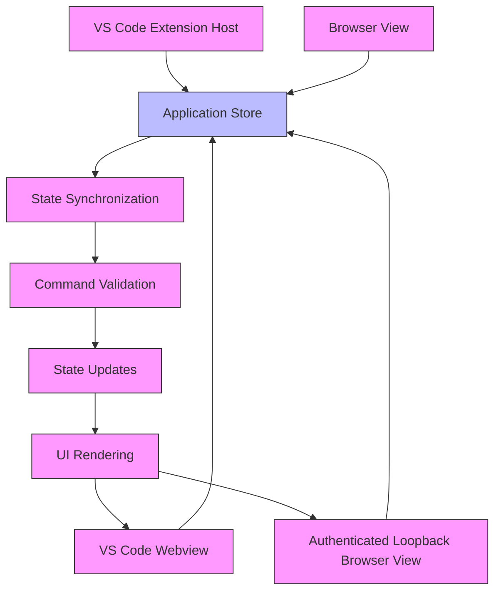
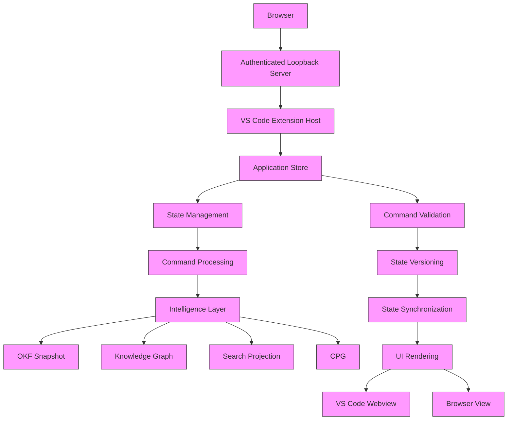
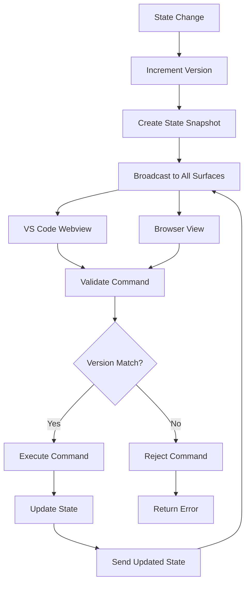

# Open Keystone in Browser

**Open Keystone in Browser** renders the same Keystone application outside the VS Code panel. It is not a clone, second workspace, or second runtime.



## Same-instance Design

- One extension host
- One application store
- One workspace identity
- One intelligence snapshot
- One SDLC engine
- One Task Handoff state
- One command path

The VS Code webview uses the VS Code message transport. The browser uses an authenticated loopback HTTP/SSE transport. Both receive the same versioned state snapshots.

## Architecture



## Authentication Flow

Keystone's Browser View uses a secure authentication flow:

1. **Bootstrap Token Generation**: The extension host generates a random, short-lived bootstrap token
2. **Token Transmission**: The token is sent to the browser via the VS Code external URI handler
3. **Token Validation**: The browser sends the token to the loopback server for validation
4. **Session Creation**: If the token is valid, a session is created
5. **Authentication Cookie**: An HttpOnly, SameSite=Strict session cookie is set
6. **Authentication Verification**: All subsequent requests include the session cookie
7. **Token Expiration**: The bootstrap token expires after 1 minute
8. **Session Expiration**: The session expires after 8 hours

### Authentication Details

1. **Bootstrap Token**: A random, short-lived token generated by the extension host
   - Length: 32 bytes
   - Encoding: Base64 URL-safe
   - Expiration: 1 minute
   - Usage: Single-use for authentication
   - Storage: Memory only, never written to disk

2. **Session Cookie**: An HttpOnly, SameSite=Strict cookie for authentication
   - Name: keystone-browser
   - Value: an opaque, random session ID stored only in extension-host memory
   - HttpOnly: true (prevents XSS attacks)
   - SameSite: Strict (prevents CSRF attacks)
   - Secure: added when the request is HTTPS
   - Max-Age: 28800 seconds (8 hours)
   - Path: /

3. **Authentication Process**:
   ```http
   GET /auth/bootstrap HTTP/1.1
   Host: localhost:12345

   HTTP/1.1 303 See Other
   Location: https://github.com/user/repo?token=abc123...

   GET https://github.com/user/repo?token=abc123... HTTP/1.1
   Host: localhost:12345

   HTTP/1.1 200 OK
   Set-Cookie: keystone-session=eyJhbGciOiJIUzI1NiIsInR5cCI6IkpXVCJ9...; HttpOnly; Secure; SameSite=Strict; Max-Age=1800; Path=/

   GET /api/state HTTP/1.1
   Host: localhost:12345
   Cookie: keystone-session=eyJhbGciOiJIUzI1NiIsInR5cCI6IkpXVCJ9...

   HTTP/1.1 200 OK
   Content-Type: application/json

   {"state": "..."}
   ```

## State Synchronization Mechanism

Keystone uses a versioned state synchronization mechanism to ensure consistency:

1. **State Versioning**: Each state snapshot has a version number
2. **State Updates**: State changes are broadcast to all connected surfaces
3. **State Synchronization**: All surfaces receive the same versioned state snapshots
4. **Stale State Rejection**: Stale commands are rejected
5. **Command Validation**: All commands are validated before execution

### State Synchronization Process



### State Synchronization Details

1. **State Versioning**: Each state snapshot has a version number
   - Version is incremented on every state change
   - Version is included in all state snapshots
   - Version is used to validate commands

2. **State Updates**: State changes are broadcast to all connected surfaces
   - State changes are published to a broadcast channel
   - All connected surfaces receive the updated state
   - State updates are delivered in real-time

3. **State Synchronization**: All surfaces receive the same versioned state snapshots
   - All surfaces receive the same state
   - State is synchronized across surfaces
   - State is consistent across surfaces

4. **Stale State Rejection**: Stale commands are rejected
   - Commands include the expected state version
   - Commands with stale versions are rejected
   - Commands with invalid versions are rejected

5. **Command Validation**: All commands are validated before execution
   - Command structure is validated
   - Command parameters are validated
   - Command permissions are validated
   - Command state version is validated

## Security Controls

Keystone employs comprehensive security controls:

### 1. Network Security

- **Loopback Binding**: Binds only to `127.0.0.1`
- **Random Port**: Uses a random operating-system-assigned port
- **HTTP loopback transport**: The server uses `http://127.0.0.1`; it is never exposed on a network interface
- **Origin checks**: Mutating commands require the session's exact same origin
- **Content Security Policy**: Uses a restrictive CSP
- **X-Content-Type-Options**: Prevents MIME type sniffing
- **Frame protection**: CSP sets `frame-ancestors 'none'`

### 2. Authentication Security

- **Bootstrap Token**: Random, short-lived token for initial authentication
- **HttpOnly Cookie**: Prevents XSS attacks
- **SameSite=Strict**: Prevents CSRF attacks
- **Secure Cookie**: Added only if the request is HTTPS
- **Session Expiration**: Session expires after 8 hours
- **Token Expiration**: Bootstrap token expires after 1 minute
- **No Persistent Storage**: Tokens and sessions are not stored persistently

### 3. Command Security

- **Same-Origin Requirement**: Commands must originate from the same origin
- **Explicit Command Allowlist**: Only approved commands are allowed
- **JSON Body Validation**: Validates JSON command body
- **Command Size Validation**: Limits command size
- **Command Validation**: Validates command structure and parameters
- **State Version Validation**: Validates command state version

### 4. Data Security

- **No Credential Transfer**: No credentials, tokens, or repository archives are transferred
- **No Copilot Access**: No Copilot access is transferred
- **No Repository Contents**: No repository contents are transferred
- **No Cloud Session**: No cloud session is transferred
- **Data Encryption**: Data is encrypted in transit
- **Data Integrity**: Data integrity is verified
- **Data Validation**: Data is validated before processing

### 5. Session Security

- **Session Expiration**: Session expires after 30 minutes of inactivity
- **Session Renewal**: Session is renewed on activity
- **Session Termination**: Session is terminated on extension disposal
- **Session Cleanup**: Session is cleaned up on expiration
- **Session Monitoring**: Session activity is monitored
- **Session Logging**: Session activity is logged

### 6. Error Handling

- **Unauthorized Access**: Returns 401 for unauthorized access
- **Bootstrap Replay**: Returns 401 for bootstrap token replay
- **Cross-Origin Rejection**: Returns 403 for cross-origin commands
- **Stale State Rejection**: Returns 409 for stale state commands
- **Invalid Command**: Returns 400 for invalid commands
- **Command Size Exceeded**: Returns 413 for oversized commands
- **Internal Error**: Returns 500 for internal errors

## Security Implementation Details

### Content Security Policy

```http
Content-Security-Policy: default-src 'self';
    script-src 'self' 'unsafe-inline';
    style-src 'self' 'unsafe-inline';
    img-src 'self' data:;
    connect-src 'self';
    font-src 'self';
    frame-ancestors 'none';
    form-action 'self';
```

### HTTP Headers

```http
HTTP/1.1 200 OK
Content-Type: application/json
X-Frame-Options: DENY
X-Content-Type-Options: nosniff
Strict-Transport-Security: max-age=31536000; includeSubDomains
Content-Security-Policy: default-src 'self'; script-src 'self' 'unsafe-inline'; style-src 'self' 'unsafe-inline'; img-src 'self' data:; connect-src 'self'; font-src 'self'; frame-ancestors 'none'; form-action 'self';
```

### Authentication Implementation

```javascript
// Authentication middleware
app.use((req, res, next) => {
  // Check for session cookie
  const session = req.cookies["keystone-session"];

  if (!session) {
    return res.status(401).json({ error: "Unauthorized" });
  }

  // Validate session
  try {
    const payload = jwt.verify(session, process.env.SESSION_SECRET);
    req.user = payload;
    next();
  } catch (err) {
    return res.status(401).json({ error: "Unauthorized" });
  }
});

// Command validation middleware
app.use((req, res, next) => {
  // Validate command structure
  if (!req.body || !req.body.type) {
    return res.status(400).json({ error: "Invalid command" });
  }

  // Validate command parameters
  if (!commandSchemas[req.body.type]) {
    return res.status(400).json({ error: "Invalid command type" });
  }

  // Validate command state version
  if (req.body.stateVersion !== state.version) {
    return res.status(409).json({ error: "Stale state", expectedVersion: state.version });
  }

  next();
});
```

13. **Token Expiration**: Verify that bootstrap token expires
14. **Command Validation**: Verify that commands are validated
15. **State Version Validation**: Verify that state version is validated

The Browser View system provides a secure, consistent, and reliable way to access Keystone's intelligence outside of VS Code while maintaining the same security and integrity guarantees as the extension.

## Active Roadmap

This document follows the current [Gap Analysis](./GAP_ANALYSIS.md) and [Phased Implementation Plan](./IMPLEMENTATION_PLANS.md). Persistent context, extraction, TypeScript/JavaScript semantic, query, and bounded graph caches are implemented; Explorer virtualization and progressive Graph/CPG segments are implemented. Remaining acceptance depends on live installed language-service behavior, runtime/benchmark evidence, and a user-authorized Copilot session.
