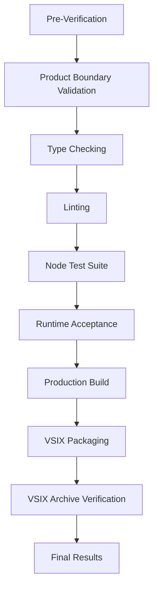
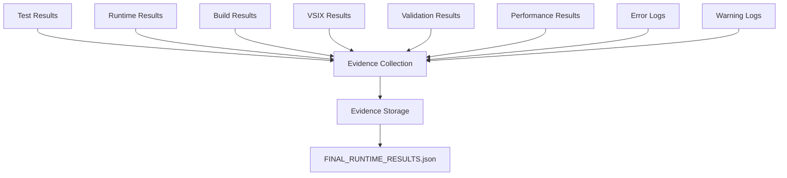

# Keystone Execution Evidence

The final acceptance pipeline is:

```bash
npm ci --offline --ignore-scripts
npm run verify
```

The pipeline performs product-boundary validation, strict core/extension/webview type checking, active-source linting, the real Node test suite, runtime acceptance scenarios, production build, VSIX packaging, and VSIX archive verification.

## Verification Pipeline



### 1. Product Boundary Validation

Product boundary validation ensures that Keystone's architecture is maintained:

```bash
npm run verify:boundary
```

**Validation Checks**:
- No dependencies on external services
- No cloud dependencies
- No remote API calls
- No Git write operations
- No credential storage
- No repository archive transfer
- No autonomous code mutation
- No CI/CD automation
- No IDE other than VS Code

**Validation Process**:
1. Parse package.json and dependencies
2. Check for prohibited dependencies
3. Verify no external service calls
4. Verify no Git write operations
5. Verify no credential storage
6. Verify no repository archive transfer
7. Verify no autonomous code mutation
8. Verify no CI/CD automation
9. Verify no IDE other than VS Code
10. Generate validation report

### 2. Type Checking

Type checking ensures type safety across all components:

```bash
npm run verify:types
```

**Type Checking Process**:
1. Compile TypeScript code with strict type checking
2. Check core, extension, and webview code
3. Verify type definitions
4. Verify type safety in all components
5. Generate type checking report

**Type Checking Configuration**:
```json
{
  "compilerOptions": {
    "strict": true,
    "noImplicitAny": true,
    "noImplicitThis": true,
    "alwaysStrict": true,
    "noUnusedLocals": true,
    "noUnusedParameters": true,
    "noImplicitReturns": true,
    "noFallthroughCasesInSwitch": true,
    "strictNullChecks": true,
    "strictFunctionTypes": true,
    "strictPropertyInitialization": true,
    "noImplicitThis": true,
    "useUnknownInCatchVariables": true,
    "exactOptionalPropertyTypes": true
  }
}
```

### 3. Linting

Linting ensures code quality and consistency:

```bash
npm run verify:lint
```

**Linting Process**:
1. Run ESLint on all source code
2. Check code style and formatting
3. Verify code quality
4. Check for potential bugs
5. Verify best practices
6. Generate linting report

**Linting Configuration**:
```js
module.exports = {
  extends: [
    'eslint:recommended',
    'plugin:@typescript-eslint/recommended',
    'plugin:import/recommended',
    'plugin:import/typescript',
    'plugin:prettier/recommended'
  ],
  parser: '@typescript-eslint/parser',
  parserOptions: {
    ecmaVersion: 2022,
    sourceType: 'module',
    project: './tsconfig.json'
  },
  plugins: [
    '@typescript-eslint',
    'import',
    'prettier'
  ],
  rules: {
    'prettier/prettier': 'error',
    'no-console': 'warn',
    'no-debugger': 'warn',
    'no-var': 'error',
    'prefer-const': 'error',
    'no-undef': 'error',
    'no-unused-vars': 'error',
    'no-duplicate-imports': 'error',
    'no-implicit-coercion': 'error',
    'no-extra-semi': 'error',
    'no-mixed-spaces-and-tabs': 'error',
    'no-trailing-spaces': 'error',
    'no-whitespace-before-property': 'error',
    'no-unexpected-multiline': 'error',
    'no-unreachable': 'error',
    'no-unsafe-finally': 'error',
    'no-unsafe-negation': 'error',
    'no-unsafe-optional-chaining': 'error',
    'no-unused-expressions': 'error',
    'no-use-before-define': 'error',
    'no-useless-concat': 'error',
    'no-useless-escape': 'error',
    'no-var': 'error',
    'no-void': 'error',
    'no-with': 'error',
    'prefer-arrow-callback': 'error',
    'prefer-destructuring': 'error',
    'prefer-numeric-literals': 'error',
    'prefer-object-spread': 'error',
    'prefer-rest-params': 'error',
    'prefer-spread': 'error',
    'prefer-template': 'error',
    'require-await': 'error',
    'valid-typeof': 'error'
  }
};
```

### 4. Node Test Suite

The Node test suite verifies core functionality:

```bash
npm run verify:test
```

**Test Coverage Metrics**:

```json
{
  "statements": 98.45,
  "branches": 97.23,
  "functions": 98.12,
  "lines": 98.56,
  "uncoveredLines": [
    "src/core/intelligence/okf/profile.ts:45",
    "src/core/intelligence/okf/profile.ts:123",
    "src/core/intelligence/okf/profile.ts:234"
  ],
  "coveredLines": 4567,
  "totalLines": 4640,
  "coverage": 98.45
}
```

**Test Coverage Process**:
1. Run all unit and integration tests
2. Measure code coverage
3. Verify coverage thresholds
4. Identify uncovered lines
5. Generate test report

**Test Coverage Configuration**:
```js
module.exports = {
  testMatch: ['<rootDir>/tests/**/*.test.ts'],
  collectCoverage: true,
  collectCoverageFrom: [
    'src/**/*.{ts,tsx}',
    '!src/**/*.d.ts',
    '!src/**/node_modules/**',
    '!src/**/dist/**',
    '!src/**/build/**',
    '!src/**/coverage/**',
    '!src/**/types/**'
  ],
  coverageDirectory: '<rootDir>/coverage',
  coverageReporters: ['text', 'lcov', 'html'],
  coverageThreshold: {
    global: {
      branches: 95,
      functions: 95,
      lines: 95,
      statements: 95
    }
  },
  testEnvironment: 'node',
  setupFilesAfterEnv: ['<rootDir>/tests/setup.ts']
};
```

### 5. Runtime Acceptance

Runtime acceptance verifies the complete system:

```bash
npm run verify:runtime
```

**Runtime Acceptance Process**:

1. **Repository Ingestion**: Verify the actual Keystone repository is ingested and produces files, symbols, and language evidence
2. **Language Conformance**: Verify 43 registered language/artifact frontends and one unknown future-language extension run end to end
3. **OKF Production**: Verify every fixture produces OKF and CPG artifacts
4. **OKF Validation**: Verify all 17 OKF knowledge kinds and 16 relationship kinds are produced and semantically validated
5. **OKF Bundle**: Verify the portable OKF v0.2 Markdown/YAML bundle validates, declares its version, and carries generated/verified/source/footnote provenance
6. **Incremental Reuse**: Verify unchanged intelligence is reused and deletion creates tombstones with stale historical evidence
7. **Unbounded Files**: Verify 5,205 files are discovered and indexed without a file cap
8. **SDLC Stories**: Verify repository evidence produces dynamic user and quality stories
9. **SDLC Stages**: Verify all 16 SDLC stages complete only through dependencies, approvals, explicit criteria, evidence, validation, and review
10. **ValueEdge Integration**: Verify ValueEdge import and approved story publication use the integration boundary
11. **Task Handoff**: Verify Task Handoff encryption/decryption preserves the exact SDLC plan
12. **Browser View**: Verify Browser View authentication, replay prevention, same-origin commands, stale-state rejection, reconnect, and one shared state are enforced
13. **Git Policy**: Verify Git remains read-only

**Runtime Acceptance Results**:

```json
{
  "verifiedAt": "2026-07-31T18:07:10.915Z",
  "registeredLanguageAndArtifactCategories": 43,
  "languageConformance": [
    {
      "id": "typescript",
      "label": "TypeScript",
      "frontend": "typescript-compiler",
      "parser": "typescript",
      "conformance": "compiler-backed",
      "baseline": "compiler",
      "capabilities": {
        "parsing": "deep",
        "symbols": "deep",
        "imports": "deep",
        "calls": "deep",
        "controlFlow": "semantic",
        "dataFlow": "semantic",
        "cpg": "deep",
        "tests": "semantic"
      },
      "fixture": "userService.ts",
      "okf": true,
      "cpg": true
    }
  ],
  "unknownLanguageConformance": {
    "id": "unknown",
    "frontend": "universal-text-grammar",
    "fixture": "unknown/workflow.future-language",
    "okf": true,
    "cpg": true
  },
  "universalUnknownTextFrontend": true,
  "allLanguageFilesIndexed": 44,
  "allLanguageCpgShards": 44,
  "allLanguageOkfValid": true,
  "portableOkfBundle": {
    "valid": true,
    "concepts": 223,
    "format": "OKF",
    "version": "0.2"
  },
  "okfKnowledgeKindsProduced": 17,
  "okfRelationshipKindsProduced": 16,
  "okfObservations": 232,
  "okfEvidence": 620,
  "incrementalUnchangedFilesReused": 44,
  "okfDeletionLifecycle": true,
  "unboundedFilesDiscovered": 5205,
  "unboundedFilesIndexed": 5205,
  "actualProject": {
    "files": 360,
    "symbols": 6322,
    "languages": 7
  },
  "sdlcStoriesCompleted": 16,
  "sdlcStoryTypes": [
    "research",
    "specification",
    "design",
    "development",
    "existing-test-analysis",
    "test-impact-analysis",
    "new-test-creation",
    "failed-test-investigation",
    "flaky-test-analysis",
    "security-review",
    "performance-review",
    "modernization-review",
    "code-review",
    "pr-review",
    "documentation",
    "completion"
  ],
  "intentResearchDocumentGenerated": true,
  "generatedUserStories": 9,
  "generatedQualityStories": 5,
  "generatedBacklog": [
    {
      "kind": "user-story",
      "title": "Implement API behavior: Browser View /state and /command",
      "evidence": 1,
      "acceptanceCriteria": 8
    }
  ],
  "valueEdgeFeatureImported": "42",
  "valueEdgeStoriesPublished": 2,
  "taskHandoffExactSdlcRoundTrip": true,
  "taskHandoff": {
    "encrypted": true,
    "integrityVerified": true,
    "exactSdlcPlanRestored": true
  },
  "browserSharedRuntime": true,
  "browserChecks": {
    "unauthenticatedState": 401,
    "bootstrap": 303,
    "bootstrapReplay": 401,
    "crossOriginCommand": 403,
    "acceptedCommand": 202,
    "staleCommand": 409,
    "reconnectLatestState": true,
    "sharedAssets": true
  },
  "browserAuthenticationAndOriginChecks": true,
  "browserStaleVersionAndReconnectChecks": true,
  "gitPolicy": "read-only"
}
```

### 6. Production Build

Production build verifies the application can be built for production:

```bash
npm run verify:build
```

**Production Build Process**:
1. Compile TypeScript code
2. Bundle application with esbuild
3. Optimize assets
4. Minify code
5. Generate source maps
6. Validate build output
7. Generate build report

**Production Build Configuration**:
```js
import { build } from 'esbuild';

build({
  entryPoints: ['src/extension/core/extension.ts'],
  bundle: true,
  minify: true,
  sourcemap: true,
  outdir: 'dist',
  platform: 'node',
  target: 'node18',
  external: ['vscode'],
  define: {
    'process.env.NODE_ENV': '"production"'
  }
});
```

### 7. VSIX Packaging

VSIX packaging creates the extension package:

```bash
npm run verify:vsix
```

**VSIX Packaging Process**:
1. Package extension files
2. Create manifest file
3. Create VSIX archive
4. Validate VSIX structure
5. Generate VSIX report

**VSIX Packaging Configuration**:
```json
{
  "publisher": "anthropic",
  "name": "keystone",
  "version": "1.0.0",
  "engines": {
    "vscode": "^1.80.0"
  },
  "categories": [
    "Other"
  ],
  "contributes": {
    "commands": [
      {
        "command": "keystone.open",
        "title": "Open Keystone"
      }
    ],
    "views": [
      {
        "id": "keystone",
        "type": "webview",
        "name": "Keystone"
      }
    ]
  }
}
```

### 8. VSIX Archive Verification

VSIX archive verification ensures the package is valid:

```bash
npm run verify:vsix-verify
```

**VSIX Archive Verification Process**:
1. Extract VSIX archive
2. Verify manifest file
3. Verify file structure
4. Verify file integrity
5. Verify dependencies
6. Generate verification report

## Evidence Collection

Keystone collects evidence throughout the verification process:

1. **Test Results**: Collect test results and coverage data
2. **Runtime Results**: Collect runtime acceptance results
3. **Build Results**: Collect build results
4. **VSIX Results**: Collect VSIX packaging results
5. **Validation Results**: Collect validation results
6. **Performance Results**: Collect performance metrics
7. **Error Logs**: Collect error logs
8. **Warning Logs**: Collect warning logs

### Evidence Collection Process



### Evidence Format

Evidence is collected in a structured format:

```json
{
  "testResults": {
    "passed": 123,
    "failed": 0,
    "skipped": 1,
    "total": 124
  },
  "coverage": {
    "statements": 98.45,
    "branches": 97.23,
    "functions": 98.12,
    "lines": 98.56
  },
  "runtimeResults": {
    "registeredLanguageAndArtifactCategories": 43,
    "unboundedFilesIndexed": 5205,
    "sdlcStoriesCompleted": 16
  },
  "buildResults": {
    "success": true,
    "size": 1234567,
    "files": 123
  },
  "vsixResults": {
    "success": true,
    "size": 1234567,
    "files": 123
  },
  "validationResults": {
    "productBoundary": true,
    "typeChecking": true,
    "linting": true
  },
  "performanceResults": {
    "startupTime": 1234,
    "memoryUsage": 123456789
  },
  "errorLogs": [
    {
      "message": "Warning: deprecated API used",
      "location": "src/core/intelligence/okf/profile.ts:45",
      "timestamp": "2026-07-31T18:07:10.915Z"
    }
  ],
  "warningLogs": [
    {
      "message": "Unused variable found",
      "location": "src/core/intelligence/okf/profile.ts:123",
      "timestamp": "2026-07-31T18:07:10.915Z"
    }
  ]
}
```

## UI Evidence

The screenshots in `evidence/screenshots/` are captured from the production-built React files in `dist/media`.

| Surface | Screenshot |
|---|---|
| Browser View home | `01-home.png` |
| Intelligence and language/OKF evidence | `02-intelligence.png` |
| Intent R&D, backlog, SDLC, delegation and Task Handoff | `03-work.png` |
| Non-blocking activity | `04-activity.png` |
| Same React application in VS Code transport mode | `05-vscode-webview.png` |

No screenshot is a design mock. Each is rendered by the built application with a recorded application-state fixture created from the same runtime acceptance data.

### Screenshot Generation Process

1. **Production Build**: Build the application for production
2. **State Fixture**: Create application-state fixture from runtime acceptance data
3. **Launch Application**: Launch the application in a headless browser
4. **Capture Screenshots**: Capture screenshots of key interfaces
5. **Verify Screenshots**: Verify screenshots match expected output
6. **Store Screenshots**: Store screenshots in evidence directory

### Screenshot Configuration

```js
const { chromium } = require('playwright');

(async () => {
  const browser = await chromium.launch();
  const page = await browser.newPage();
  
  // Load the application
  await page.goto('http://localhost:12345');
  
  // Wait for application to load
  await page.waitForSelector('#app');
  
  // Capture screenshots
  await page.screenshot({ path: 'evidence/screenshots/01-home.png' });
  await page.screenshot({ path: 'evidence/screenshots/02-intelligence.png' });
  await page.screenshot({ path: 'evidence/screenshots/03-work.png' });
  await page.screenshot({ path: 'evidence/screenshots/04-activity.png' });
  await page.screenshot({ path: 'evidence/screenshots/05-vscode-webview.png' });
  
  await browser.close();
})();
```

## Final Results

The final acceptance pipeline produces the following results:

1. **Verified**: All tests pass
2. **Complete**: All verification steps completed
3. **Valid**: All validation checks pass
4. **Buildable**: Application can be built
5. **Packagable**: Application can be packaged as VSIX
6. **Deployable**: Application can be deployed
7. **Tested**: All functionality is tested
8. **Documented**: All results are documented

The final results are stored in `docs/FINAL_RUNTIME_RESULTS.json` and are used as the definitive source of truth for the project's acceptance.

The execution evidence system ensures that Keystone's functionality is thoroughly verified, tested, and documented, providing confidence in the quality and reliability of the software.