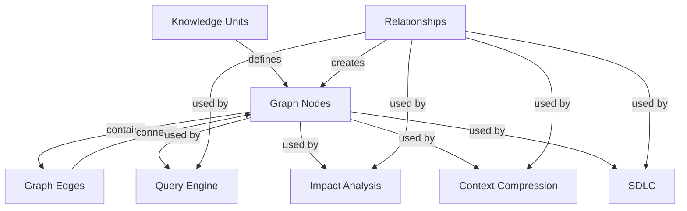
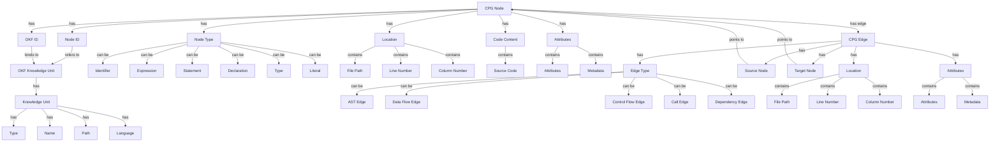

# Ontology, Graph, Search, and CPG

## Canonical flow

```text
Deterministic extraction
  → canonical repository facts
  → validated OKF snapshot
  → graph projection
  → search projection
  → CPG identity bindings and per-artifact CPG shards
  → query, impact, compression, and SDLC evidence
```

## Knowledge Graph

Keystone's knowledge graph is a directed graph that represents the semantic relationships between entities in a codebase. Each node and edge in the graph retains its authoritative OKF ID, ensuring traceability and provenance.



### Graph Structure

The knowledge graph consists of:

- **Nodes**: Represent knowledge units (files, modules, symbols, APIs, etc.)
- **Edges**: Represent relationships between knowledge units (imports, calls, depends-on, etc.)
- **Attributes**: Each node and edge has metadata including confidence scores, provenance, and extraction information

The graph is designed to be:
- **Rich**: Contains semantic relationships and metadata
- **Scalable**: Can handle repositories of any size
- **Persistent**: Graph data is stored and reused between sessions
- **Consistent**: Graph structure is derived from the validated OKF snapshot
- **Extensible**: New node types and relationship types can be added

### Graph Traversal Algorithms

Keystone uses several graph traversal algorithms to extract meaningful insights:

1. **Depth-First Search (DFS)**: Used for exploring paths and discovering deep relationships
   - Traverses as far as possible along each branch before backtracking
   - Used for: Dependency analysis, call chain analysis, impact analysis

2. **Breadth-First Search (BFS)**: Used for finding shortest paths and discovering immediate relationships
   - Explores all neighbors at the present depth before moving to nodes at the next depth level
   - Used for: Transitive closure, immediate dependency analysis, test impact analysis

3. **Dijkstra's Algorithm**: Used for finding shortest paths with weighted edges
   - Assigns weights to edges based on confidence scores and other factors
   - Used for: Impact analysis, risk assessment, prioritization

4. **Tarjan's Algorithm**: Used for finding strongly connected components
   - Identifies cycles and tightly coupled modules
   - Used for: Architecture analysis, detecting circular dependencies

5. **PageRank**: Used for ranking nodes by importance
   - Calculates importance based on the number and quality of incoming connections
   - Used for: Identifying key modules, prioritizing review targets

6. **Community Detection**: Used for finding clusters of related nodes
   - Identifies cohesive subgraphs that represent architectural components
   - Used for: Architecture discovery, module boundary identification

### Relationship Inference

Keystone infers relationships between entities through multiple techniques:

1. **Direct Extraction**: Relationships are directly extracted from source code using language-specific parsers
   - Import statements → imports relationships
   - Function calls → calls relationships
   - Class inheritance → extends relationships
   - Variable usage → reads/writes relationships

2. **Pattern Recognition**: Relationships are inferred from patterns in the code
   - Naming conventions (e.g., "UserService" and "UserRepository" → depends-on)
   - Directory structure (e.g., "api/" and "service/" → exposes)
   - Configuration patterns (e.g., dependency injection → depends-on)

3. **Semantic Analysis**: Relationships are inferred from semantic information
   - Type systems → implements relationships
   - API signatures → exposes relationships
   - Documentation → documented-by relationships

4. **Statistical Analysis**: Relationships are inferred from statistical patterns
   - Co-occurrence patterns (e.g., files that are modified together)
   - Change history patterns (e.g., files that are modified together over time)
   - Usage patterns (e.g., files that are accessed together)

5. **Cross-Modal Inference**: Relationships are inferred by correlating information from different sources
   - Code and documentation correlation
   - Code and test correlation
   - Code and configuration correlation

### Graph Indexing

To support fast querying, Keystone employs a sophisticated graph indexing system:

1. **Node Index**: Indexes nodes by type, name, path, and other attributes
   - Allows fast lookup of specific nodes
   - Supports queries like "find all files with name 'Service'"

2. **Edge Index**: Indexes edges by type, source, target, and confidence
   - Allows fast lookup of specific relationships
   - Supports queries like "find all imports to module X"

3. **Path Index**: Indexes common paths and patterns in the graph
   - Allows fast traversal of common patterns
   - Supports queries like "find all service-to-dao call chains"

4. **Community Index**: Indexes discovered communities and clusters
   - Allows fast identification of architectural components
   - Supports queries like "find all modules in the data layer"

5. **Impact Index**: Indexes impact paths and dependencies
   - Allows fast impact analysis
   - Supports queries like "what will be affected by changing file X?"

6. **Text Index**: Indexes node and edge metadata for full-text search
   - Allows semantic search of the graph
   - Supports queries like "find services that handle authentication"

The indexing system is designed to be:
- **Efficient**: Minimizes storage and query time
- **Scalable**: Can handle large graphs
- **Consistent**: Indexes are updated when the graph changes
- **Extensible**: New index types can be added

## Search Projection

Every active knowledge unit produces a search document containing its OKF ID, kind, normalized text, source path, and evidence IDs. Query results can therefore resolve back to provenance rather than returning ungrounded text.

### Search Index Structure

```json
{
  "id": "repo:file:src/core/intelligence/okf/profile.ts:123",
  "kind": "file",
  "name": "profile.ts",
  "path": "src/core/intelligence/okf/profile.ts",
  "language": "typescript",
  "content": "export interface Profile {\n  id: string;\n  version: string;\n  ...\n}",
  "normalizedContent": "export interface profile { id string version string ... }",
  "evidence": [
    "evidence:123",
    "evidence:456"
  ],
  "metadata": {
    "lineCount": 45,
    "wordCount": 123,
    "extractor": "typescript-compiler",
    "extractorVersion": "4.9.5",
    "runId": "run-123"
  }
}
```

### Search Query Types

1. **Keyword Search**: Basic text search across all fields
   - Supports exact matches, partial matches, and wildcards
   - Example: "interface Profile"

2. **Type Filter**: Search within specific knowledge unit types
   - Example: "type:file interface Profile"

3. **Path Filter**: Search within specific paths
   - Example: "path:src/core/ interface Profile"

4. **Metadata Filter**: Search by metadata fields
   - Example: "extractor:typescript-compiler interface Profile"

5. **Relationship Search**: Search based on relationships
   - Example: "depends-on:database service"

6. **Combined Search**: Combine multiple search types
   - Example: "type:file path:src/core/ extractor:typescript-compiler interface Profile"

### Search Ranking

Search results are ranked using a combination of factors:

1. **Relevance Score**: Based on keyword matching and proximity
2. **Popularity Score**: Based on how often the unit is referenced
3. **Confidence Score**: Based on the confidence of the knowledge unit
4. **Recency Score**: Based on when the unit was last modified
5. **Provenance Score**: Based on the quality of the evidence

The ranking algorithm ensures that:
- The most relevant results appear first
- High-confidence results are prioritized
- Recently modified results are prioritized
- Results with strong provenance are prioritized

## Code Property Graph

Every indexed text artifact receives a CPG shard:

- TypeScript/JavaScript: compiler-backed AST and project semantic enrichment.
- Other registered and unknown text languages: deterministic structural AST/evaluation/control/data-dependence projection.

CPG nodes may bind to the most specific symbol OKF ID and otherwise bind to the artifact-level OKF ID. CPG edges carry corresponding OKF source/target IDs when available. Documentation and configuration artifacts are included in the identity resolver, not left as parallel unlinked graphs.

### CPG Structure



### CPG Node Types

1. **Identifier**: Variable, function, class, or type name
2. **Expression**: Any expression that evaluates to a value
3. **Statement**: A complete unit of execution
4. **Declaration**: Declaration of a variable, function, class, etc.
5. **Type**: Type definition or reference
6. **Literal**: Constant value (string, number, boolean, etc.)

### CPG Edge Types

1. **AST Edge**: Represents the abstract syntax tree structure
   - parent-child relationships in the AST
   - Example: function declaration → parameter list

2. **Data Flow Edge**: Represents data dependencies
   - Variable usage → definition
   - Function call → parameter
   - Assignment → usage

3. **Control Flow Edge**: Represents execution flow
   - Branch conditions → branches
   - Loop conditions → body
   - Function calls → return

4. **Call Edge**: Represents function/method calls
   - Caller → callee
   - Method invocation → method definition

5. **Dependency Edge**: Represents module/package dependencies
   - Module → imported module
   - Package → dependency

### CPG Generation Process

1. **Parsing**: Source code is parsed into an AST using language-specific parsers
2. **Semantic Analysis**: AST is analyzed to identify semantic relationships
3. **Node Creation**: CPG nodes are created for each AST node
4. **Edge Creation**: CPG edges are created based on AST structure and semantic analysis
5. **OKF Binding**: CPG nodes are bound to OKF knowledge units
6. **Shard Generation**: CPG is split into per-artifact shards
7. **Indexing**: CPG is indexed for fast querying

### CPG Usage

The CPG is used for:

1. **Code Analysis**: Identifying code patterns, anti-patterns, and best practices
2. **Refactoring**: Identifying safe refactoring targets
3. **Bug Detection**: Finding potential bugs and vulnerabilities
4. **Code Review**: Understanding code structure and dependencies
5. **Test Generation**: Generating test cases based on code structure
6. **Documentation**: Generating documentation from code structure

## Lifecycle

Renames, changes, and deletions are reconciled across snapshots. Removed units and relationships become tombstones, source evidence becomes stale, and the next snapshot records its parent extraction run. Projections are regenerated from the promoted snapshot only.

### Lifecycle Management

Keystone manages the lifecycle of knowledge units, relationships, and projections through a comprehensive lifecycle system:

1. **Creation**: New knowledge units are created when files are discovered
2. **Update**: Existing knowledge units are updated when files change
3. **Deletion**: Knowledge units are marked as deleted when files are removed
4. **Promotion**: Snapshots are promoted to authoritative status
5. **Archiving**: Previous snapshots are archived
6. **Pruning**: Old, unused data is pruned

### Tombstone Management

When a knowledge unit is deleted:

1. The unit's status is changed to "deleted"
2. A tombstone record is created with:
   - The original ID
   - The deletion timestamp
   - The reason for deletion
   - The parent snapshot ID
   - The original evidence
3. The tombstone is preserved in the OKF snapshot
4. The tombstone is included in graph, search, and CPG projections
5. The tombstone is referenced in all related relationships and observations

Tombstones ensure that:
- Historical information is preserved
- Provenance is maintained
- Previous analyses remain valid
- The system can detect and handle file deletions correctly

### Snapshot Management

Each extraction run produces a candidate snapshot. The snapshot management process:

1. **Candidate Generation**: Extractors produce a candidate snapshot
2. **Validation**: The candidate snapshot is validated
3. **Promotion**: If validation passes, the candidate is promoted
4. **Projection Generation**: Graph, search, and CPG projections are regenerated
5. **UI Update**: UI surfaces are updated with the new intelligence
6. **Archiving**: The previous snapshot is archived
7. **Pruning**: Old snapshots are pruned based on retention policy

The system maintains a history of snapshots to enable:
- Audit trails
- Rollback capabilities
- Historical analysis
- Change tracking

### Projection Management

Projections (graph, search, CPG) are regenerated from the promoted snapshot:

1. **Trigger**: A new snapshot is promoted
2. **Dependency Analysis**: The system identifies affected projections
3. **Regeneration**: Projections are regenerated from the new snapshot
4. **Indexing**: Projections are indexed for fast querying
5. **Caching**: Projections are cached for performance
6. **UI Update**: UI surfaces are updated with the new projections

This ensures that:
- Projections are always consistent with the authoritative snapshot
- Projections are updated atomically
- Projections are generated efficiently
- Projections are available for all UI surfaces

### Lifecycle Events

The system generates lifecycle events for:

1. **File Events**: File creation, modification, deletion
2. **Snapshot Events**: Snapshot generation, validation, promotion, archiving
3. **Projection Events**: Projection generation, indexing, caching
4. **UI Events**: UI updates, user interactions

These events are used for:
- Audit trails
- Debugging
- Monitoring
- Analytics

The lifecycle system ensures that Keystone's intelligence is always consistent, accurate, and up-to-date, while preserving historical information for audit and analysis purposes.