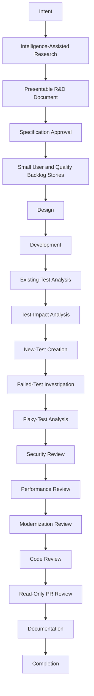
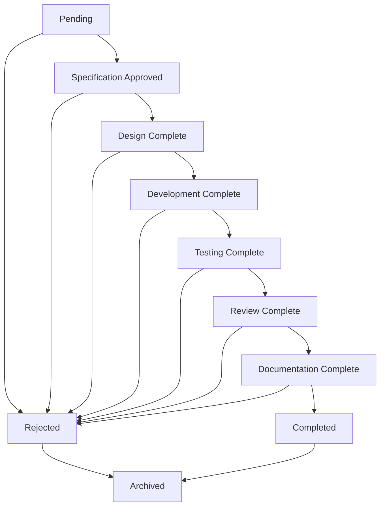
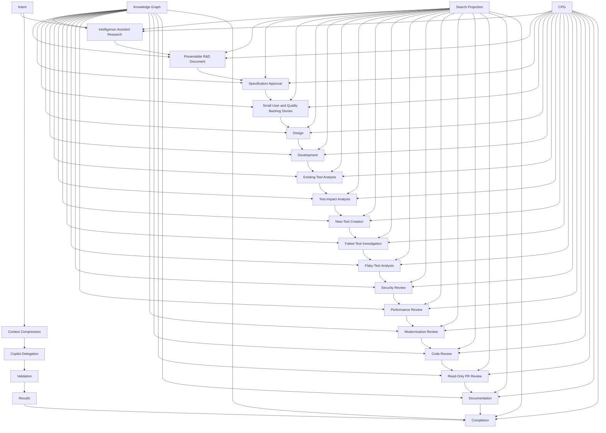
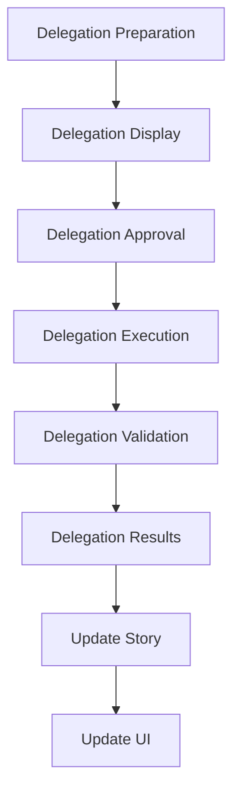

# Intent-Led SDLC

Keystone uses one continuous workflow rather than separate Intent, Task, and Delivery products.



## Durable Story Model

Each story stores objective, dependencies, status, acceptance criteria, satisfied criteria, evidence, blockers, decisions, context-pack reference, Copilot delegation, validation runs, findings, timestamps, and result state.

### Story Schema

```json
{
  "id": "story:123",
  "type": "user-story",
  "title": "Implement API behavior: Browser View /state and /command",
  "objective": "Implement the API behavior for Browser View to support state and command operations",
  "description": "The Browser View needs to support state synchronization and command execution through a secure API endpoint",
  "status": "in-progress",
  "dependencies": [
    "story:456",
    "story:789"
  ],
  "acceptanceCriteria": [
    "Browser View must expose /state endpoint",
    "Browser View must expose /command endpoint",
    "/state endpoint must return current state in JSON format",
    "/command endpoint must accept JSON commands",
    "/command endpoint must validate commands before execution",
    "/command endpoint must return execution results",
    "All endpoints must be secured with authentication",
    "All endpoints must be documented in API reference"
  ],
  "satisfiedCriteria": [
    "Browser View must expose /state endpoint",
    "Browser View must expose /command endpoint",
    "/state endpoint must return current state in JSON format",
    "/command endpoint must accept JSON commands"
  ],
  "evidence": [
    "evidence:123",
    "evidence:456",
    "evidence:789"
  ],
  "blockers": [
    {
      "id": "blocker:123",
      "type": "dependency",
      "description": "API authentication system not implemented",
      "resolved": false,
      "created": "2026-08-01T12:34:56Z",
      "updated": "2026-08-01T12:34:56Z"
    }
  ],
  "decisions": [
    {
      "id": "decision:123",
      "description": "Use JWT for API authentication",
      "reason": "JWT is lightweight, stateless, and widely supported",
      "created": "2026-08-01T12:34:56Z",
      "updated": "2026-08-01T12:34:56Z"
    }
  ],
  "contextPack": "context-pack:123",
  "copilotDelegation": {
    "agent": "code-reviewer",
    "instructions": "Review the implementation of the Browser View API endpoints",
    "skills": [
      "code-review",
      "security-review"
    ],
    "status": "pending",
    "result": null
  },
  "validationRuns": [
    {
      "id": "validation:123",
      "type": "unit-test",
      "status": "passed",
      "timestamp": "2026-08-01T12:34:56Z",
      "details": {
        "testsPassed": 12,
        "testsFailed": 0,
        "coverage": 95
      }
    }
  ],
  "findings": [
    {
      "id": "finding:123",
      "type": "security-risk",
      "description": "API endpoints lack rate limiting",
      "severity": "high",
      "status": "open",
      "created": "2026-08-01T12:34:56Z",
      "updated": "2026-08-01T12:34:56Z"
    }
  ],
  "timestamps": {
    "created": "2026-08-01T12:34:56Z",
    "updated": "2026-08-01T12:34:56Z",
    "started": "2026-08-01T12:34:56Z",
    "completed": null
  },
  "resultState": {
    "success": false,
    "message": "Waiting for API authentication system implementation",
    "details": {}
  }
}
```

**Story Fields**:
- `id`: Unique identifier for the story (required)
- `type`: Type of story (user-story, quality-story, research, specification, design, development, existing-test-analysis, test-impact-analysis, new-test-creation, failed-test-investigation, flaky-test-analysis, security-review, performance-review, modernization-review, code-review, pr-review, documentation, completion) (required)
- `title`: Title of the story (required)
- `objective`: Objective of the story (required)
- `description`: Detailed description of the story (required)
- `status`: Status of the story (pending, in-progress, completed) (required)
- `dependencies`: Array of story IDs that this story depends on (optional)
- `acceptanceCriteria`: Array of acceptance criteria (required)
- `satisfiedCriteria`: Array of satisfied acceptance criteria (optional)
- `evidence`: Array of evidence IDs that support this story (optional)
- `blockers`: Array of blockers (optional)
  - `id`: Unique identifier for the blocker (required)
  - `type`: Type of blocker (dependency, technical, resource, external) (required)
  - `description`: Description of the blocker (required)
  - `resolved`: Whether the blocker is resolved (required)
  - `created`: Timestamp when the blocker was created (required)
  - `updated`: Timestamp when the blocker was last updated (required)
- `decisions`: Array of decisions made (optional)
  - `id`: Unique identifier for the decision (required)
  - `description`: Description of the decision (required)
  - `reason`: Reason for the decision (required)
  - `created`: Timestamp when the decision was made (required)
  - `updated`: Timestamp when the decision was last updated (required)
- `contextPack`: ID of the context pack (optional)
- `copilotDelegation`: Copilot delegation information (optional)
  - `agent`: Copilot agent to use (required)
  - `instructions`: Instructions for the Copilot agent (required)
  - `skills`: Array of skills to use (optional)
  - `status`: Status of the delegation (pending, in-progress, completed, failed) (required)
  - `result`: Result of the delegation (optional)
- `validationRuns`: Array of validation runs (optional)
  - `id`: Unique identifier for the validation run (required)
  - `type`: Type of validation (unit-test, integration-test, security-test, performance-test, code-review, pr-review, documentation-review) (required)
  - `status`: Status of the validation (pending, in-progress, passed, failed) (required)
  - `timestamp`: Timestamp of the validation run (required)
  - `details`: Details about the validation run (optional)
    - `testsPassed`: Number of tests passed (optional)
    - `testsFailed`: Number of tests failed (optional)
    - `coverage`: Test coverage percentage (optional)
- `findings`: Array of findings (optional)
  - `id`: Unique identifier for the finding (required)
  - `type`: Type of finding (security-risk, performance-issue, modernization-opportunity, code-smell, test-coverage, documentation-missing, etc.) (required)
  - `description`: Description of the finding (required)
  - `severity`: Severity of the finding (low, medium, high, critical) (required)
  - `status`: Status of the finding (open, in-progress, resolved, suppressed) (required)
  - `created`: Timestamp when the finding was created (required)
  - `updated`: Timestamp when the finding was last updated (required)
- `timestamps`: Timestamps (required)
  - `created`: Timestamp when the story was created (required)
  - `updated`: Timestamp when the story was last updated (required)
  - `started`: Timestamp when the story was started (required)
  - `completed`: Timestamp when the story was completed (optional)
- `resultState`: Result state (required)
  - `success`: Whether the story was successful (required)
  - `message`: Message about the result (required)
  - `details`: Details about the result (optional)

## State and Gates

The domain state machine validates transitions. Specification approval is explicit. Delegation is prepared, displayed, approved, completed, and validated. Completion requires:

- All acceptance criteria satisfied
- Evidence present
- Dependencies complete
- No unresolved blockers
- No unresolved high/critical finding unless explicitly accepted
- A passing validation run for executable/review stories

### State Machine



### State Transition Rules

1. **Pending to Specification Approved**: Requires explicit user approval of the specification
2. **Specification Approved to Design Complete**: Requires completion of the design phase
3. **Design Complete to Development Complete**: Requires completion of the development phase
4. **Development Complete to Testing Complete**: Requires completion of all testing phases
5. **Testing Complete to Review Complete**: Requires completion of all review phases
6. **Review Complete to Documentation Complete**: Requires completion of documentation
7. **Documentation Complete to Completed**: Requires all acceptance criteria to be satisfied
8. **Any State to Rejected**: Requires explicit user rejection
9. **Rejected to Archived**: Automatically when rejected
10. **Completed to Archived**: Automatically when completed

### Gate Validation

Each gate has validation rules:

1. **Specification Approval Gate**:
   - All acceptance criteria are clearly defined
   - All dependencies are identified
   - All evidence is present
   - All blockers are documented
   - Specification is approved by user

2. **Design Complete Gate**:
   - Design is complete and documented
   - All technical decisions are recorded
   - All dependencies are resolved
   - All risks are identified and mitigated
   - Design is approved by user

3. **Development Complete Gate**:
   - All code is implemented
   - All tests are written
   - All documentation is updated
   - All dependencies are resolved
   - All risks are mitigated
   - Code is reviewed

4. **Testing Complete Gate**:
   - All tests pass
   - Test coverage meets requirements
   - All bugs are fixed
   - All performance requirements are met
   - All security requirements are met
   - All review feedback is addressed

5. **Review Complete Gate**:
   - All code review feedback is addressed
   - All security review feedback is addressed
   - All performance review feedback is addressed
   - All modernization review feedback is addressed
   - All PR review feedback is addressed
   - All documentation review feedback is addressed

6. **Documentation Complete Gate**:
   - All documentation is complete
   - All documentation is accurate
   - All documentation is up-to-date
   - All documentation is approved
   - All documentation is linked to code

7. **Completed Gate**:
   - All acceptance criteria are satisfied
   - All evidence is present
   - All dependencies are complete
   - No unresolved blockers
   - No unresolved high/critical finding unless explicitly accepted
   - A passing validation run for executable/review stories

## QA and Review

Test impact uses explicit test mappings, coverage evidence, and reverse graph traversal. Failed tests produce classification and approval-gated remediation proposals; Keystone never silently weakens or heals tests. Security, performance, modernization, code review, and PR review are first-class stories. PR review reads diffs and prepares reviewer content but never mutates a remote PR/MR.

### QA Process

1. **Test Mapping**: Explicitly map tests to code elements
2. **Coverage Analysis**: Analyze test coverage
3. **Impact Analysis**: Use reverse graph traversal to identify impact
4. **Failed Test Analysis**: Classify failed tests and propose remediation
5. **Test Creation**: Create new tests as needed
6. **Test Validation**: Validate test quality and effectiveness

### Review Process

1. **Security Review**: Identify security vulnerabilities and propose fixes
2. **Performance Review**: Identify performance bottlenecks and propose optimizations
3. **Modernization Review**: Identify outdated patterns and propose modernization
4. **Code Review**: Review code quality and adherence to standards
5. **PR Review**: Review pull requests and prepare reviewer content

### QA and Review Details

1. **Test Mapping**: Explicitly map tests to code elements:
   - Test to function
   - Test to class
   - Test to module
   - Test to file
   - Test to component
2. **Coverage Analysis**: Analyze test coverage:
   - Line coverage
   - Branch coverage
   - Function coverage
   - Statement coverage
   - Path coverage
3. **Impact Analysis**: Use reverse graph traversal to identify impact:
   - Identify affected tests
   - Identify affected code
   - Identify affected dependencies
   - Identify affected components
   - Identify affected systems
4. **Failed Test Analysis**: Classify failed tests and propose remediation:
   - Test failure type (logic error, environment issue, race condition, etc.)
   - Failure cause
   - Impact analysis
   - Remediation proposal
   - Priority assessment
5. **Test Creation**: Create new tests as needed:
   - Identify missing test cases
   - Create new test cases
   - Validate test cases
   - Integrate new tests
   - Document new tests
6. **Test Validation**: Validate test quality and effectiveness:
   - Test readability
   - Test maintainability
   - Test reliability
   - Test performance
   - Test coverage

### Review Details

1. **Security Review**: Identify security vulnerabilities and propose fixes:
   - Input validation
   - Authentication
   - Authorization
   - Data validation
   - Error handling
   - Logging
   - Configuration
   - Dependencies
   - Network security
   - Code quality
2. **Performance Review**: Identify performance bottlenecks and propose optimizations:
   - Algorithm efficiency
   - Memory usage
   - I/O operations
   - Network usage
   - Database queries
   - Caching
   - Concurrency
   - Resource management
   - Scalability
   - Latency
3. **Modernization Review**: Identify outdated patterns and propose modernization:
   - Language features
   - Library versions
   - Framework versions
   - Design patterns
   - Architecture patterns
   - Development practices
   - Testing practices
   - Deployment practices
   - Monitoring practices
   - Security practices
4. **Code Review**: Review code quality and adherence to standards:
   - Code style
   - Code structure
   - Code complexity
   - Code readability
   - Code maintainability
   - Code testability
   - Code documentation
   - Code consistency
   - Code reusability
   - Code extensibility
5. **PR Review**: Review pull requests and prepare reviewer content:
   - Code changes
   - Test changes
   - Documentation changes
   - Configuration changes
   - Dependency changes
   - Build changes
   - Deployment changes
   - Security changes
   - Performance changes
   - Modernization changes

## SDLC Workflow

The SDLC workflow is a continuous process that integrates all aspects of software development:



### Workflow Details

1. **Intent**: The user expresses an intent, which can be:
   - A feature request
   - A bug report
   - A performance issue
   - A security concern
   - A modernization opportunity
   - A code review request
   - A documentation request
   - A research question

2. **Intelligence-Assisted Research**: Keystone uses its intelligence layer to assist with research:
   - Analyzes the repository for relevant information
   - Identifies related code, tests, and documentation
   - Identifies dependencies and impacts
   - Identifies potential solutions
   - Identifies risks and challenges

3. **Presentable R&D Document**: Generate a research document:
   - Summary of findings
   - Analysis of options
   - Recommendations
   - Risks and challenges
   - Dependencies
   - Impact analysis
   - Evidence

4. **Specification Approval**: The user reviews and approves the specification:
   - Review the R&D document
   - Approve the specification
   - Add comments and suggestions
   - Approve or reject the specification

5. **Small User and Quality Backlog Stories**: Generate backlog stories:
   - User stories for features
   - Quality stories for non-functional requirements
   - Test stories for test coverage
   - Security stories for security requirements
   - Performance stories for performance requirements
   - Modernization stories for modernization requirements
   - Code review stories for code quality requirements
   - Documentation stories for documentation requirements

6. **Design**: Create a design:
   - Architecture design
   - Component design
   - API design
   - Database design
   - UI design
   - Security design
   - Performance design
   - Modernization design
   - Test design
   - Documentation design

7. **Development**: Implement the design:
   - Write code
   - Write tests
   - Update documentation
   - Update configuration
   - Update dependencies
   - Update build
   - Update deployment
   - Update monitoring

8. **Existing-Test Analysis**: Analyze existing tests:
   - Identify relevant tests
   - Analyze test coverage
   - Identify test gaps
   - Identify test quality issues
   - Identify test performance issues
   - Identify test security issues
   - Identify test maintainability issues

9. **Test-Impact Analysis**: Analyze test impact:
   - Identify affected tests
   - Identify affected code
   - Identify affected dependencies
   - Identify affected components
   - Identify affected systems
   - Identify test coverage impact
   - Identify test quality impact
   - Identify test performance impact
   - Identify test security impact
   - Identify test maintainability impact

10. **New-Test Creation**: Create new tests:
    - Identify missing test cases
    - Create new test cases
    - Validate test cases
    - Integrate new tests
    - Document new tests
    - Optimize test performance
    - Improve test quality
    - Improve test security
    - Improve test maintainability

11. **Failed-Test Investigation**: Investigate failed tests:
    - Classify test failures
    - Identify test failure causes
    - Analyze test impact
    - Propose remediation
    - Prioritize remediation
    - Implement remediation
    - Validate remediation
    - Document findings

12. **Flaky-Test Analysis**: Analyze flaky tests:
    - Identify flaky tests
    - Classify flaky test types
    - Identify flaky test causes
    - Analyze flaky test impact
    - Propose remediation
    - Prioritize remediation
    - Implement remediation
    - Validate remediation
    - Document findings

13. **Security Review**: Review security:
    - Identify security vulnerabilities
    - Analyze security risks
    - Propose security fixes
    - Prioritize security fixes
    - Implement security fixes
    - Validate security fixes
    - Document security findings

14. **Performance Review**: Review performance:
    - Identify performance bottlenecks
    - Analyze performance risks
    - Propose performance optimizations
    - Prioritize performance optimizations
    - Implement performance optimizations
    - Validate performance optimizations
    - Document performance findings

15. **Modernization Review**: Review modernization:
    - Identify outdated patterns
    - Analyze modernization opportunities
    - Propose modernization
    - Prioritize modernization
    - Implement modernization
    - Validate modernization
    - Document modernization findings

16. **Code Review**: Review code:
    - Review code quality
    - Review code structure
    - Review code complexity
    - Review code readability
    - Review code maintainability
    - Review code testability
    - Review code documentation
    - Review code consistency
    - Review code reusability
    - Review code extensibility

17. **Read-Only PR Review**: Review pull requests:
    - Review code changes
    - Review test changes
    - Review documentation changes
    - Review configuration changes
    - Review dependency changes
    - Review build changes
    - Review deployment changes
    - Review security changes
    - Review performance changes
    - Review modernization changes

18. **Documentation**: Create documentation:
    - Create API documentation
    - Create user documentation
    - Create developer documentation
    - Create architecture documentation
    - Create design documentation
    - Create test documentation
    - Create security documentation
    - Create performance documentation
    - Create modernization documentation
    - Create code documentation

19. **Completion**: Complete the story:
    - Verify all acceptance criteria
    - Verify all evidence is present
    - Verify all dependencies are complete
    - Verify all blockers are resolved
    - Verify all findings are addressed
    - Verify all validation runs pass
    - Mark story as completed
    - Archive story

## Copilot Delegation

Keystone uses Copilot delegation to assist with the SDLC process:

1. **Delegation Preparation**: Prepare delegation instructions
2. **Delegation Display**: Display delegation instructions to user
3. **Delegation Approval**: Get user approval for delegation
4. **Delegation Execution**: Execute delegation
5. **Delegation Validation**: Validate delegation results
6. **Delegation Results**: Present delegation results

### Delegation Process



### Delegation Details

1. **Delegation Preparation**: Prepare delegation instructions:
   - Identify the task
   - Identify the required skills
   - Identify the expected results
   - Identify the constraints
   - Identify the context
2. **Delegation Display**: Display delegation instructions to user:
   - Task description
   - Required skills
   - Expected results
   - Constraints
   - Context
3. **Delegation Approval**: Get user approval for delegation:
   - Review delegation instructions
   - Approve or reject delegation
   - Add comments and suggestions
4. **Delegation Execution**: Execute delegation:
   - Run Copilot agent
   - Process instructions
   - Generate results
   - Validate results
   - Log results
5. **Delegation Validation**: Validate delegation results:
   - Check results against expectations
   - Validate results against requirements
   - Check results for accuracy
   - Check results for completeness
   - Check results for quality
6. **Delegation Results**: Present delegation results:
   - Results summary
   - Detailed results
   - Evidence
   - Recommendations
   - Risks
   - Next steps
7. **Update Story**: Update story with delegation results:
   - Update findings
   - Update evidence
   - Update decisions
   - Update status
   - Update timestamps
8. **Update UI**: Update UI with delegation results:
   - Update story status
   - Update findings
   - Update evidence
   - Update decisions
   - Update timestamps

The intent-led SDLC workflow ensures that Keystone provides a comprehensive, intelligent, and efficient approach to software development that integrates all aspects of the development process.