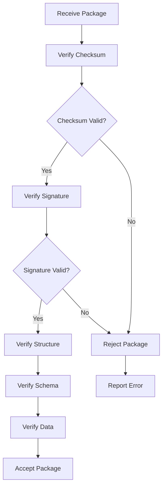

# Task Handoff

Task Handoff is an action on the active SDLC task. It transfers portable task state, not credentials, Copilot access, repository contents, or a cloud session.

## Package Contents

```text
- original intent and approved specification
- exact 16-story SDLC plan and statuses
- acceptance criteria, evidence, decisions, blockers, findings, and validation results
- relevant files, symbols, relationships, context, and intelligence snapshot reference
- branch/revision metadata for manual verification
- selected Copilot agent, instructions, and skills where present
- bounded OKF-grounded correction packets, including validation failures, selected paths, and retry prompts
- exact next recommended action
- schema version, redaction report, and integrity checksum
```

## Task Handoff Schema

```json
{
  "version": "1.0.0",
  "schema": "https://keystone.local/handoff/schema/v1",
  "metadata": {
    "created": "2026-08-01T12:34:56Z",
    "createdBy": "user:123",
    "repository": {
      "url": "https://github.com/user/repo",
      "branch": "main",
      "commit": "abc123...",
      "root": "/path/to/repo"
    },
    "intent": {
      "id": "intent:123",
      "title": "Implement User Authentication",
      "description": "Implement user authentication with OAuth2 and JWT",
      "status": "approved",
      "evidence": ["evidence:123", "evidence:456"],
      "decisions": [
        {
          "id": "decision:123",
          "description": "Use JWT for API authentication",
          "reason": "JWT is lightweight, stateless, and widely supported",
          "created": "2026-08-01T12:34:56Z"
        }
      ],
      "blockers": [
        {
          "id": "blocker:123",
          "type": "dependency",
          "description": "API authentication system not implemented",
          "resolved": false,
          "created": "2026-08-01T12:34:56Z",
          "updated": "2026-08-01T12:34:56Z"
        }
      ]
    },
    "specification": {
      "id": "specification:123",
      "title": "User Authentication Implementation",
      "description": "Implement user authentication with OAuth2 and JWT",
      "status": "approved",
      "evidence": ["evidence:123", "evidence:456"],
      "decisions": [
        {
          "id": "decision:123",
          "description": "Use JWT for API authentication",
          "reason": "JWT is lightweight, stateless, and widely supported",
          "created": "2026-08-01T12:34:56Z"
        }
      ],
      "blockers": [
        {
          "id": "blocker:123",
          "type": "dependency",
          "description": "API authentication system not implemented",
          "resolved": false,
          "created": "2026-08-01T12:34:56Z",
          "updated": "2026-08-01T12:34:56Z"
        }
      ]
    }
  },
  "sdlcPlan": {
    "id": "sdlc-plan:123",
    "stories": [
      {
        "id": "story:123",
        "type": "user-story",
        "title": "Implement API behavior: Browser View /state and /command",
        "objective": "Implement the API behavior for Browser View to support state and command operations",
        "description": "The Browser View needs to support state synchronization and command execution through a secure API endpoint",
        "status": "in-progress",
        "dependencies": ["story:456", "story:789"],
        "acceptanceCriteria": [
          "Browser View must expose /state endpoint",
          "Browser View must expose /command endpoint",
          "/state endpoint must return current state in JSON format",
          "/command endpoint must accept JSON commands",
          "/command endpoint must validate commands before execution",
          "/command endpoint must return execution results",
          "All endpoints must be secured with authentication",
          "All endpoints must be documented in API reference"
        ],
        "satisfiedCriteria": [
          "Browser View must expose /state endpoint",
          "Browser View must expose /command endpoint",
          "/state endpoint must return current state in JSON format",
          "/command endpoint must accept JSON commands"
        ],
        "evidence": ["evidence:123", "evidence:456", "evidence:789"],
        "blockers": [
          {
            "id": "blocker:123",
            "type": "dependency",
            "description": "API authentication system not implemented",
            "resolved": false,
            "created": "2026-08-01T12:34:56Z",
            "updated": "2026-08-01T12:34:56Z"
          }
        ],
        "decisions": [
          {
            "id": "decision:123",
            "description": "Use JWT for API authentication",
            "reason": "JWT is lightweight, stateless, and widely supported",
            "created": "2026-08-01T12:34:56Z",
            "updated": "2026-08-01T12:34:56Z"
          }
        ],
        "contextPack": "context-pack:123",
        "copilotDelegation": {
          "agent": "code-reviewer",
          "instructions": "Review the implementation of the Browser View API endpoints",
          "skills": ["code-review", "security-review"],
          "status": "pending",
          "result": null
        },
        "validationRuns": [
          {
            "id": "validation:123",
            "type": "unit-test",
            "status": "passed",
            "timestamp": "2026-08-01T12:34:56Z",
            "details": {
              "testsPassed": 12,
              "testsFailed": 0,
              "coverage": 95
            }
          }
        ],
        "findings": [
          {
            "id": "finding:123",
            "type": "security-risk",
            "description": "API endpoints lack rate limiting",
            "severity": "high",
            "status": "open",
            "created": "2026-08-01T12:34:56Z",
            "updated": "2026-08-01T12:34:56Z"
          }
        ],
        "timestamps": {
          "created": "2026-08-01T12:34:56Z",
          "updated": "2026-08-01T12:34:56Z",
          "started": "2026-08-01T12:34:56Z",
          "completed": null
        },
        "resultState": {
          "success": false,
          "message": "Waiting for API authentication system implementation",
          "details": {}
        }
      }
    ],
    "status": "in-progress",
    "nextAction": "Implement API authentication system",
    "evidence": ["evidence:123", "evidence:456"],
    "decisions": [
      {
        "id": "decision:123",
        "description": "Use JWT for API authentication",
        "reason": "JWT is lightweight, stateless, and widely supported",
        "created": "2026-08-01T12:34:56Z"
      }
    ],
    "blockers": [
      {
        "id": "blocker:123",
        "type": "dependency",
        "description": "API authentication system not implemented",
        "resolved": false,
        "created": "2026-08-01T12:34:56Z",
        "updated": "2026-08-01T12:34:56Z"
      }
    ]
  },
  "intelligence": {
    "snapshotId": "snapshot:123",
    "snapshotVersion": "2.1.0",
    "okfDigest": "sha256:jkl012...",
    "repository": {
      "url": "https://github.com/user/repo",
      "branch": "main",
      "commit": "abc123...",
      "root": "/path/to/repo"
    },
    "files": [
      {
        "path": "src/core/intelligence/okf/profile.ts",
        "hash": "sha256:abc123...",
        "size": 1234,
        "lines": 45
      }
    ],
    "symbols": [
      {
        "name": "Profile",
        "type": "interface",
        "file": "src/core/intelligence/okf/profile.ts",
        "line": 1,
        "column": 1
      }
    ],
    "relationships": [
      {
        "source": "repo:file:src/core/intelligence/okf/profile.ts:123",
        "target": "repo:module:src/core/intelligence/okf",
        "type": "contains",
        "confidence": 0.98,
        "level": "high"
      }
    ],
    "observations": [
      {
        "subject": "repo:file:src/core/intelligence/okf/profile.ts:123",
        "type": "security-risk",
        "value": "uses deprecated API",
        "confidence": 0.95,
        "level": "high"
      }
    ],
    "evidence": [
      {
        "source": "file:src/core/intelligence/okf/profile.ts",
        "type": "source-code",
        "range": {
          "start": {
            "line": 42,
            "column": 15
          },
          "end": {
            "line": 43,
            "column": 20
          }
        },
        "content": "import { Profile } from './profile.ts';",
        "hash": "sha256:ghi789..."
      }
    ],
    "projections": {
      "graph": {
        "nodes": [
          {
            "id": "repo:file:src/core/intelligence/okf/profile.ts:123",
            "type": "file",
            "name": "profile.ts",
            "path": "src/core/intelligence/okf/profile.ts",
            "language": "typescript",
            "contentHash": "sha256:abc123...",
            "structuralHash": "sha256:def456...",
            "size": 1234,
            "lines": 45,
            "created": "2026-08-01T12:34:56Z",
            "modified": "2026-08-01T12:34:56Z",
            "firstSeenAt": "2026-08-01T12:34:56Z",
            "lastSeenAt": "2026-08-01T12:34:56Z",
            "status": "active",
            "extractor": "typescript-compiler",
            "extractorVersion": "4.9.5",
            "runId": "run-123",
            "evidence": ["evidence:123", "evidence:456"],
            "metadata": {
              "importedFrom": "github.com/user/repo",
              "author": "John Doe",
              "tags": ["core", "intelligence"]
            }
          }
        ],
        "edges": [
          {
            "id": "relationship:123",
            "type": "contains",
            "source": "repo:file:src/core/intelligence/okf/profile.ts:123",
            "target": "repo:module:src/core/intelligence/okf",
            "confidence": 0.98,
            "level": "high",
            "extractor": "typescript-compiler",
            "extractorVersion": "4.9.5",
            "runId": "run-123",
            "evidence": ["evidence:789"],
            "metadata": {
              "line": 42,
              "column": 15,
              "source": "import { Profile } from './profile.ts';"
            }
          }
        ]
      },
      "search": [
        {
          "id": "repo:file:src/core/intelligence/okf/profile.ts:123",
          "kind": "file",
          "name": "profile.ts",
          "path": "src/core/intelligence/okf/profile.ts",
          "language": "typescript",
          "content": "export interface Profile {\n  id: string;\n  version: string;\n  ...\n}",
          "normalizedContent": "export interface profile { id string version string ... }",
          "evidence": ["evidence:123", "evidence:456"],
          "metadata": {
            "lineCount": 45,
            "wordCount": 123,
            "extractor": "typescript-compiler",
            "extractorVersion": "4.9.5",
            "runId": "run-123"
          }
        }
      ],
      "cpg": {
        "artifactId": "repo:file:src/core/intelligence/okf/profile.ts:123",
        "nodes": [
          {
            "id": "node:123",
            "type": "identifier",
            "location": {
              "path": "src/core/intelligence/okf/profile.ts",
              "line": 1,
              "column": 1
            },
            "content": "export interface Profile",
            "okfId": "repo:file:src/core/intelligence/okf/profile.ts:123",
            "attributes": {
              "name": "Profile",
              "type": "interface"
            }
          }
        ],
        "edges": [
          {
            "id": "edge:456",
            "type": "ast",
            "source": "node:123",
            "target": "node:789",
            "location": {
              "path": "src/core/intelligence/okf/profile.ts",
              "line": 1,
              "column": 1
            },
            "attributes": {}
          }
        ]
      }
    }
  },
  "context": {
    "id": "context:123",
    "type": "intent",
    "intent": "Implement user authentication with OAuth2 and JWT",
    "evidence": ["evidence:123", "evidence:456"],
    "compression": {
      "method": "adapative",
      "ratio": 0.75,
      "size": 12345
    },
    "content": "Implement user authentication with OAuth2 and JWT. Use JWT for API authentication. API endpoints must be secured with authentication. API endpoints must be documented in API reference. API authentication system not implemented. Use JWT for API authentication. JWT is lightweight, stateless, and widely supported."
  },
  "copilot": {
    "agent": "code-reviewer",
    "instructions": "Review the implementation of the Browser View API endpoints",
    "skills": ["code-review", "security-review"],
    "status": "pending",
    "result": null
  },
  "nextAction": "Implement API authentication system",
  "redactionReport": {
    "files": [
      {
        "path": ".env",
        "redacted": true,
        "reason": "contains secrets"
      },
      {
        "path": "config/secrets.json",
        "redacted": true,
        "reason": "contains secrets"
      }
    ],
    "content": [
      {
        "pattern": "SECRET_KEY=.*",
        "count": 1,
        "redacted": true
      }
    ],
    "totalRedacted": 2
  },
  "integrity": {
    "checksum": "sha256:abc123...",
    "signature": "-----BEGIN PGP SIGNATURE-----\n...\n-----END PGP SIGNATURE-----",
    "algorithm": "sha256",
    "version": "1.0.0"
  }
}
```

**Handoff Package Fields**:

### 1. Metadata

- `version`: Package version (required)
- `schema`: Schema URL (required)
- `metadata`: Package metadata (required)
  - `created`: Timestamp when the package was created (required)
  - `createdBy`: ID of the creator (required)
  - `repository`: Repository metadata (required)
    - `url`: Repository URL (required)
    - `branch`: Current branch (required)
    - `commit`: Current commit hash (required)
    - `root`: Repository root path (required)
  - `intent`: Intent information (required)
    - `id`: Unique identifier for the intent (required)
    - `title`: Title of the intent (required)
    - `description`: Detailed description of the intent (required)
    - `status`: Status of the intent (approved, pending, rejected) (required)
    - `evidence`: Array of evidence IDs (optional)
    - `decisions`: Array of decisions (optional)
      - `id`: Unique identifier for the decision (required)
      - `description`: Description of the decision (required)
      - `reason`: Reason for the decision (required)
      - `created`: Timestamp when the decision was made (required)
    - `blockers`: Array of blockers (optional)
      - `id`: Unique identifier for the blocker (required)
      - `type`: Type of blocker (dependency, technical, resource, external) (required)
      - `description`: Description of the blocker (required)
      - `resolved`: Whether the blocker is resolved (required)
      - `created`: Timestamp when the blocker was created (required)
      - `updated`: Timestamp when the blocker was last updated (required)
  - `specification`: Specification information (required)
    - `id`: Unique identifier for the specification (required)
    - `title`: Title of the specification (required)
    - `description`: Detailed description of the specification (required)
    - `status`: Status of the specification (approved, pending, rejected) (required)
    - `evidence`: Array of evidence IDs (optional)
    - `decisions`: Array of decisions (optional)
      - `id`: Unique identifier for the decision (required)
      - `description`: Description of the decision (required)
      - `reason`: Reason for the decision (required)
      - `created`: Timestamp when the decision was made (required)
    - `blockers`: Array of blockers (optional)
      - `id`: Unique identifier for the blocker (required)
      - `type`: Type of blocker (dependency, technical, resource, external) (required)
      - `description`: Description of the blocker (required)
      - `resolved`: Whether the blocker is resolved (required)
      - `created`: Timestamp when the blocker was created (required)
      - `updated`: Timestamp when the blocker was last updated (required)

### 2. SDLC Plan

- `id`: Unique identifier for the SDLC plan (required)
- `stories`: Array of stories (required)
  - `id`: Unique identifier for the story (required)
  - `type`: Type of story (user-story, quality-story, research, specification, design, development, existing-test-analysis, test-impact-analysis, new-test-creation, failed-test-investigation, flaky-test-analysis, security-review, performance-review, modernization-review, code-review, pr-review, documentation, completion) (required)
  - `title`: Title of the story (required)
  - `objective`: Objective of the story (required)
  - `description`: Detailed description of the story (required)
  - `status`: Status of the story (pending, in-progress, completed) (required)
  - `dependencies`: Array of story IDs that this story depends on (optional)
  - `acceptanceCriteria`: Array of acceptance criteria (required)
  - `satisfiedCriteria`: Array of satisfied acceptance criteria (optional)
  - `evidence`: Array of evidence IDs that support this story (optional)
  - `blockers`: Array of blockers (optional)
    - `id`: Unique identifier for the blocker (required)
    - `type`: Type of blocker (dependency, technical, resource, external) (required)
    - `description`: Description of the blocker (required)
    - `resolved`: Whether the blocker is resolved (required)
    - `created`: Timestamp when the blocker was created (required)
    - `updated`: Timestamp when the blocker was last updated (required)
  - `decisions`: Array of decisions made (optional)
    - `id`: Unique identifier for the decision (required)
    - `description`: Description of the decision (required)
    - `reason`: Reason for the decision (required)
    - `created`: Timestamp when the decision was made (required)
    - `updated`: Timestamp when the decision was last updated (required)
  - `contextPack`: ID of the context pack (optional)
  - `copilotDelegation`: Copilot delegation information (optional)
    - `agent`: Copilot agent to use (required)
    - `instructions`: Instructions for the Copilot agent (required)
    - `skills`: Array of skills to use (optional)
    - `status`: Status of the delegation (pending, in-progress, completed, failed) (required)
    - `result`: Result of the delegation (optional)
  - `validationRuns`: Array of validation runs (optional)
    - `id`: Unique identifier for the validation run (required)
    - `type`: Type of validation (unit-test, integration-test, security-test, performance-test, code-review, pr-review, documentation-review) (required)
    - `status`: Status of the validation (pending, in-progress, passed, failed) (required)
    - `timestamp`: Timestamp of the validation run (required)
    - `details`: Details about the validation run (optional)
      - `testsPassed`: Number of tests passed (optional)
      - `testsFailed`: Number of tests failed (optional)
      - `coverage`: Test coverage percentage (optional)
  - `findings`: Array of findings (optional)
    - `id`: Unique identifier for the finding (required)
    - `type`: Type of finding (security-risk, performance-issue, modernization-opportunity, code-smell, test-coverage, documentation-missing, etc.) (required)
    - `description`: Description of the finding (required)
    - `severity`: Severity of the finding (low, medium, high, critical) (required)
    - `status`: Status of the finding (open, in-progress, resolved, suppressed) (required)
    - `created`: Timestamp when the finding was created (required)
    - `updated`: Timestamp when the finding was last updated (required)
  - `timestamps`: Timestamps (required)
    - `created`: Timestamp when the story was created (required)
    - `updated`: Timestamp when the story was last updated (required)
    - `started`: Timestamp when the story was started (required)
    - `completed`: Timestamp when the story was completed (optional)
  - `resultState`: Result state (required)
    - `success`: Whether the story was successful (required)
    - `message`: Message about the result (required)
    - `details`: Details about the result (optional)
- `status`: Status of the SDLC plan (pending, in-progress, completed) (required)
- `nextAction`: Next recommended action (required)
- `evidence`: Array of evidence IDs (optional)
- `decisions`: Array of decisions made (optional)
  - `id`: Unique identifier for the decision (required)
  - `description`: Description of the decision (required)
  - `reason`: Reason for the decision (required)
  - `created`: Timestamp when the decision was made (required)
- `blockers`: Array of blockers (optional)
  - `id`: Unique identifier for the blocker (required)
  - `type`: Type of blocker (dependency, technical, resource, external) (required)
  - `description`: Description of the blocker (required)
  - `resolved`: Whether the blocker is resolved (required)
  - `created`: Timestamp when the blocker was created (required)
  - `updated`: Timestamp when the blocker was last updated (required)

### 3. Intelligence

- `snapshotId`: ID of the intelligence snapshot (required)
- `snapshotVersion`: Version of the intelligence snapshot (required)
- `okfDigest`: SHA-256 digest of the OKF snapshot (required)
- `repository`: Repository metadata (required)
  - `url`: Repository URL (required)
  - `branch`: Current branch (required)
  - `commit`: Current commit hash (required)
  - `root`: Repository root path (required)
- `files`: Array of files (optional)
  - `path`: File path (required)
  - `hash`: SHA-256 hash of the file (required)
  - `size`: File size in bytes (required)
  - `lines`: Number of lines in the file (required)
- `symbols`: Array of symbols (optional)
  - `name`: Name of the symbol (required)
  - `type`: Type of symbol (required)
  - `file`: File path (required)
  - `line`: Line number (required)
  - `column`: Column number (required)
- `relationships`: Array of relationships (optional)
  - `source`: ID of the source knowledge unit (required)
  - `target`: ID of the target knowledge unit (required)
  - `type`: Type of relationship (required)
  - `confidence`: Confidence score (0.0-1.0) (required)
  - `level`: Confidence level (low, medium, high, critical) (required)
- `observations`: Array of observations (optional)
  - `subject`: ID of the subject unit (required)
  - `type`: Type of observation (required)
  - `value`: The observation value (required)
  - `confidence`: Confidence score (0.0-1.0) (required)
  - `level`: Confidence level (low, medium, high, critical) (required)
- `evidence`: Array of evidence items (optional)
  - `source`: Source path (required)
  - `type`: Type of evidence (required)
  - `range`: Source code range (optional)
    - `start`: Start location (required)
      - `line`: Line number (required)
      - `column`: Column number (required)
    - `end`: End location (required)
      - `line`: Line number (required)
      - `column`: Column number (required)
  - `content`: The evidence content (required for source code)
  - `hash`: SHA-256 hash of the evidence content (required)
- `projections`: Projections (required)
  - `graph`: Knowledge graph (required)
    - `nodes`: Array of nodes (required)
      - `id`: Unique identifier for the node (required)
      - `type`: Type of node (file, module, package, service, symbol, api, data-entity, configuration, test, documentation, call-flow, data-flow, architecture-boundary, risk-area, change-impact, database, table, orm-entity, query, feature-flag, fixture, ci-cd, infrastructure, component, event, build-system, package-manager) (required)
      - `name`: Name of the node (required for most types)
      - `path`: File system path to the node (required for file types)
      - `language`: Programming language of the node (optional)
      - `contentHash`: SHA-256 hash of the file content (required for files)
      - `structuralHash`: SHA-256 hash of the structural representation (required for files)
      - `size`: File size in bytes (required for files)
      - `lines`: Number of lines in the file (required for files)
      - `created`: Creation timestamp (optional)
      - `modified`: Last modification timestamp (required)
      - `firstSeenAt`: First time this node was discovered (required)
      - `lastSeenAt`: Last time this node was observed (required)
      - `status`: Lifecycle status (active, deprecated, deleted) (required)
      - `extractor`: Name of the extractor that produced this node (required)
      - `extractorVersion`: Version of the extractor (required)
      - `runId`: ID of the extraction run that produced this node (required)
      - `evidence`: Array of evidence IDs that support this node (optional)
      - `metadata`: Additional metadata about the node (optional)
    - `edges`: Array of edges (required)
      - `id`: Unique identifier for the edge (required)
      - `type`: Type of edge (contains, defines, imports, depends-on, calls, reads, writes, exposes, implements, extends, tests, covers, configured-by, documented-by, flows-to, may-impact) (required)
      - `source`: ID of the source node (required)
      - `target`: ID of the target node (required)
      - `confidence`: Confidence score (0.0-1.0) (required)
      - `level`: Confidence level (low, medium, high, critical) (required)
      - `extractor`: Name of the extractor that produced this edge (required)
      - `extractorVersion`: Version of the extractor (required)
      - `runId`: ID of the extraction run that produced this edge (required)
      - `evidence`: Array of evidence IDs that support this edge (optional)
      - `metadata`: Additional metadata about the edge (optional)
  - `search`: Array of search documents (required)
    - `id`: ID of the knowledge unit (required)
    - `kind`: Kind of knowledge unit (required)
    - `name`: Name of the knowledge unit (required)
    - `path`: File system path to the knowledge unit (required)
    - `language`: Programming language of the knowledge unit (optional)
    - `content`: Content of the knowledge unit (required)
    - `normalizedContent`: Normalized content of the knowledge unit (required)
    - `evidence`: Array of evidence IDs (optional)
    - `metadata`: Additional metadata about the knowledge unit (optional)
  - `cpg`: Code Property Graph (required)
    - `artifactId`: ID of the artifact this CPG represents (required)
    - `nodes`: Array of nodes (required)
      - `id`: Unique identifier for the node (required)
      - `type`: Type of node (identifier, expression, statement, declaration, type, literal) (required)
      - `location`: Location of the node in the source code (required)
        - `path`: File path (required)
        - `line`: Line number (required)
        - `column`: Column number (required)
      - `content`: The source code content of the node (required)
      - `okfId`: ID of the corresponding OKF knowledge unit (required)
      - `attributes`: Additional attributes about the node (optional)
    - `edges`: Array of edges (required)
      - `id`: Unique identifier for the edge (required)
      - `type`: Type of edge (AST, data-flow, control-flow, call, dependency) (required)
      - `source`: ID of the source node (required)
      - `target`: ID of the target node (required)
      - `location`: Location of the edge in the source code (required)
        - `path`: File path (required)
        - `line`: Line number (required)
        - `column`: Column number (required)
      - `attributes`: Additional attributes about the edge (optional)

### 4. Context

- `id`: Unique identifier for the context (required)
- `type`: Type of context (intent, task, etc.) (required)
- `intent`: Intent of the context (required)
- `evidence`: Array of evidence IDs (optional)
- `compression`: Compression information (required)
  - `method`: Compression method (required)
  - `ratio`: Compression ratio (required)
  - `size`: Compressed size (required)
- `content`: Compressed context content (required)

### 5. Copilot

- `agent`: Copilot agent to use (required)
- `instructions`: Instructions for the Copilot agent (required)
- `skills`: Array of skills to use (optional)
- `status`: Status of the delegation (pending, in-progress, completed, failed) (required)
- `result`: Result of the delegation (optional)

### 6. Next Action

- `nextAction`: Next recommended action (required)

### 7. Redaction Report

- `files`: Array of redacted files (required)
  - `path`: File path (required)
  - `redacted`: Whether the file was redacted (required)
  - `reason`: Reason for redaction (required)
- `content`: Array of redacted content patterns (required)
  - `pattern`: Regular expression pattern (required)
  - `count`: Number of matches (required)
  - `redacted`: Whether the content was redacted (required)
- `totalRedacted`: Total number of redactions (required)

### 8. Integrity

- `checksum`: SHA-256 checksum of the package (required)
- `signature`: PGP signature of the package (optional)
- `algorithm`: Hash algorithm used (required)
- `version`: Integrity schema version (required)

The verified package may also include an optional top-level `correctionPackets` array. Each packet retains its OKF snapshot digest, Git diff hash, changed paths, OKF-affected paths, selected unit/relationship/evidence IDs, bounded source paths, validation failures and remediations, any captured Copilot excerpt, the user-approved retry prompt, and optional resolution metadata. Restoring a package materializes these packets in the recipient task workspace as `correction-packets.json`.

## Creation Process

1. **Open the Active Task**: Open the active SDLC task
2. **Choose Create Task Handoff**: Select the Create Task Handoff option
3. **Derive Package**: Keystone derives the package from authoritative extension-host and SDLC state
4. **Redaction**: Secret patterns and excluded paths are scanned and redacted
5. **Checksum**: The package is checksummed
6. **Encryption**: The package is encrypted with AES-256-GCM using a scrypt-derived key
7. **Package Creation**: The encrypted package is created
8. **Share Package**: The user shares the encrypted package
9. **Communicate Passphrase**: The user communicates the passphrase separately

## Redaction Process

Keystone employs a comprehensive redaction process to ensure security:

1. **Pattern Detection**: Scan for sensitive patterns in files and content
2. **File Redaction**: Redact files containing sensitive information
3. **Content Redaction**: Redact sensitive content in files
4. **Report Generation**: Generate a redaction report

### Redaction Patterns

Keystone detects and redacts the following patterns:

1. **API Keys**: `API_KEY=.*`, `API_TOKEN=.*`, `API_SECRET=.*`
2. **Secrets**: `SECRET=.*`, `PASSWORD=.*`, `PASSPHRASE=.*`
3. **Credentials**: `USERNAME=.*`, `USER=.*`, `LOGIN=.*`
4. **Tokens**: `TOKEN=.*`, `ACCESS_TOKEN=.*`, `REFRESH_TOKEN=.*`
5. **Keys**: `PRIVATE_KEY=.*`, `PUBLIC_KEY=.*`, `KEY=.*`
6. **Passwords**: `PASS=.*`, `PWD=.*`, `PW=.*`
7. **API Endpoints**: `API_URL=.*`, `BASE_URL=.*`, `ENDPOINT=.*`
8. **Database Credentials**: `DB_HOST=.*`, `DB_PORT=.*`, `DB_NAME=.*`, `DB_USER=.*`, `DB_PASS=.*`
9. **Cloud Credentials**: `AWS_ACCESS_KEY_ID=.*`, `AWS_SECRET_ACCESS_KEY=.*`, `AWS_SESSION_TOKEN=.*`
10. **Authentication Tokens**: `JWT=.*`, `OAUTH_TOKEN=.*`, `BASIC_AUTH=.*`

### File Redaction

Files containing sensitive information are redacted:

- `.env` files
- `config/secrets.json`
- `secrets.yml`
- `credentials.json`
- `private.key`
- `public.key`
- Any file with a name containing "secret", "key", "password", "token", "credential"

### Content Redaction

Sensitive content is redacted:

- API keys
- Secret tokens
- Passwords
- Credentials
- Private keys
- Database credentials
- Cloud credentials
- Authentication tokens

### Redaction Report

The redaction report includes:

- List of redacted files
- List of redacted content patterns
- Total number of redactions
- Redaction reason for each redaction

## Encryption Process

Keystone employs AES-256-GCM encryption with scrypt key derivation:

1. **Key Generation**: Generate a 256-bit encryption key using scrypt
   - Salt: Random 32-byte salt
   - N: 16384 (CPU/memory cost parameter)
   - r: 8 (block size)
   - p: 1 (parallelization parameter)
   - dkLen: 32 (derived key length)
2. **IV Generation**: Generate a 96-bit initialization vector
3. **Encryption**: Encrypt the package using AES-256-GCM
4. **Authentication**: Generate an authentication tag
5. **Package Creation**: Combine encrypted data, IV, and authentication tag
6. **Key Derivation**: Derive a key from the passphrase using scrypt
7. **Key Encryption**: Encrypt the encryption key with the derived key
8. **Package Storage**: Store the encrypted package and encrypted key

### Encryption Details

- **Algorithm**: AES-256-GCM
- **Key Size**: 256 bits
- **IV Size**: 96 bits
- **Authentication Tag Size**: 128 bits
- **Key Derivation**: scrypt
- **scrypt Parameters**:
  - N: 16384
  - r: 8
  - p: 1
  - dkLen: 32

The encryption ensures that:

- The package is secure
- The data cannot be read without the passphrase
- The data cannot be tampered with
- The data integrity is preserved

## Integrity Verification

Keystone employs a comprehensive integrity verification process:

1. **Checksum Verification**: Verify the package checksum
2. **Signature Verification**: Verify the PGP signature (if present)
3. **Structure Verification**: Verify the package structure
4. **Schema Verification**: Verify the package schema
5. **Data Verification**: Verify the data integrity

### Integrity Verification Process



### Integrity Verification Details

1. **Checksum Verification**: Verify the SHA-256 checksum
   - Calculate checksum of received package
   - Compare with checksum in package
   - Reject if checksums don't match
2. **Signature Verification**: Verify the PGP signature (if present)
   - Verify the signature using the public key
   - Reject if signature is invalid
3. **Structure Verification**: Verify the package structure
   - Verify all required fields are present
   - Verify all required data types are correct
   - Reject if structure is invalid
4. **Schema Verification**: Verify the package schema
   - Validate against the schema definition
   - Reject if schema is invalid
5. **Data Verification**: Verify the data integrity
   - Verify all data is valid
   - Verify all references are valid
   - Reject if data is invalid

## Restore Process

1. **Manual Repository Synchronization**: The recipient manually opens and synchronizes the expected repository/branch
2. **Package Decryption**: Keystone decrypts the package using the passphrase
3. **Integrity Validation**: Keystone validates the package integrity
4. **Mismatch Warnings**: Keystone presents mismatch warnings
5. **Manual Repository Synchronization Confirmation**: The user confirms manual repository synchronization
6. **SDLC State Restoration**: Keystone previews and restores the exact SDLC/task state
7. **Work Resumption**: Work resumes from the recorded next action

## Security Considerations

Keystone ensures security in Task Handoff:

1. **No Credentials**: No credentials, tokens, or repository archives are transferred
2. **No Copilot Access**: No Copilot access is transferred
3. **No Repository Contents**: No repository contents are transferred
4. **No Cloud Session**: No cloud session is transferred
5. **Encrypted Package**: The package is encrypted with AES-256-GCM
6. **Scrypt Key Derivation**: The encryption key is derived from the passphrase using scrypt
7. **Redaction**: Sensitive information is redacted
8. **Integrity Verification**: The package integrity is verified
9. **PGP Signature**: The package can be signed with PGP
10. **No Persistent Storage**: The package is not stored persistently

The Task Handoff system allows users to securely and reliably transfer SDLC state between systems while maintaining security, integrity, and usability.

## Gap Analysis References

The following gaps identified in [GAP_ANALYSIS.md](./GAP_ANALYSIS.md) affect the Task Handoff system:

| Gap       | Title                                                                                                              | Impact on Task Handoff                                                                                                     | Implementation Plan                                                                    |
| --------- | ------------------------------------------------------------------------------------------------------------------ | -------------------------------------------------------------------------------------------------------------------------- | -------------------------------------------------------------------------------------- |
| **Gap 1** | [Continuation Packets for Long-Running Tasks](./GAP_ANALYSIS.md#gap-1-continuation-packets-for-long-running-tasks) | Task handoff packages may exceed token limits for large repositories; continuation packets enable streaming large handoffs | [Plan 1](./IMPLEMENTATION_PLANS.md#plan-1-continuation-packets-for-long-running-tasks) |
| **Gap 2** | [Context Compression Caching](./GAP_ANALYSIS.md#gap-2-context-compression-caching)                                 | Compressed context in handoff packages could benefit from persistent caching to avoid recompression                        | [Plan 2](./IMPLEMENTATION_PLANS.md#plan-2-context-compression-caching)                 |
| **Gap 4** | [Adaptive-Segments Delivery Mode](./GAP_ANALYSIS.md#gap-4-adaptive-segments-delivery-mode)                         | Handoff packages could use adaptive segmentation for progressive disclosure of intelligence data                           | [Plan 4](./IMPLEMENTATION_PLANS.md#plan-4-adaptive-segments-delivery-mode)             |
| **Gap 5** | [File Hash Caching Persistence](./GAP_ANALYSIS.md#gap-5-file-hash-caching-persistence)                             | File hashes in handoff packages could be cached persistently to speed up integrity verification                            | [Plan 5](./IMPLEMENTATION_PLANS.md#plan-5-file-hash-caching-persistence)               |
| **Gap 6** | [Extraction Result Caching Persistence](./GAP_ANALYSIS.md#gap-6-extraction-result-caching-persistence)             | Intelligence extraction results in handoff packages could be cached to avoid re-extraction                                 | [Plan 6](./IMPLEMENTATION_PLANS.md#plan-6-extraction-result-caching-persistence)       |
| **Gap 7** | [Projection Caching Persistence](./GAP_ANALYSIS.md#gap-7-projection-caching-persistence)                           | Graph/search/CPG projections in handoff packages could be cached for faster restoration                                    | [Plan 7](./IMPLEMENTATION_PLANS.md#plan-7-projection-caching-persistence)              |

**Note**: Gap 3 (Query Result Caching) has minimal direct impact on Task Handoff but is relevant for the intelligence data included in handoff packages.
