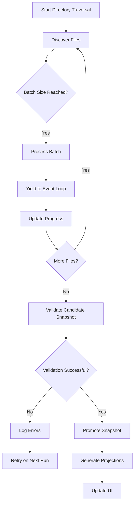
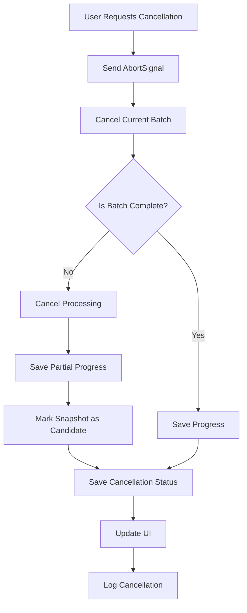
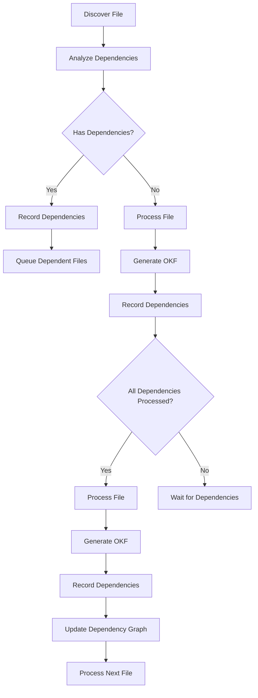
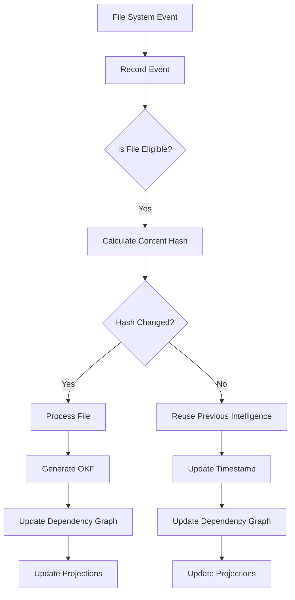

# Unbounded, Non-Blocking, Incremental Ingestion

Keystone does not impose a repository file-count ceiling, source-file-size ceiling, or user-configured ingestion budget. Repository size is unknown in advance, so discovery continues until every eligible artifact is processed, the user cancels, the workspace closes, or the extension deactivates.

## Guarantees

- Probable text artifacts are discovered regardless of extension.
- Explicit generated, dependency, cache, binary, and VCS paths are excluded.
- The target repository's root `.gitignore` rules are applied during discovery,
  including ordered negated rules for files under traversable directories.
- Dependency lockfiles, vendor-named files, source maps, and minified CSS/JS
  assets are excluded before text inspection and language analysis.
- Directory traversal and analysis yield to the event loop in batches.
- Work is cancellable through `AbortSignal`.
- Unchanged files reuse persisted hashes and extracted intelligence without semantic re-analysis.
- Changed and created files are reprocessed; deleted records become OKF tombstones.
- Candidate snapshots are never promoted until validation succeeds.
- Progress uses discovered/indexed counts without assuming a final total before discovery completes.
- Read or race failures are recorded and retried during later incremental runs.

**Current Caching State (Gap Analysis)**:

- **File identity and extraction caching**: Content hashes and deterministic language-analysis payloads persist across restarts under `.keystone/cache/extractions`, keyed by file path, content hash, and extractor version.
- **Semantic caching**: TypeScript/JavaScript compiler results persist under `.keystone/cache/semantics`, keyed by eligible source/config hashes and the TypeScript provider version. Host-dependent VS Code language-service results remain session-bound unless a future provider supplies a stable provider/configuration fingerprint.
- **Query and graph caching**: Snapshot-digest-keyed memory and persistent caches reuse authoritative query and bounded graph results; entries are age/count-pruned.
- **Context caching**: Context reuse is persisted under `.keystone/context/cache` and includes the canonical OKF snapshot digest in its key.

Implementation plans for these gaps are documented in [IMPLEMENTATION_PLANS.md](./IMPLEMENTATION_PLANS.md).

## Batch Processing Mechanism

Keystone employs a sophisticated batch processing mechanism to handle unbounded repositories efficiently:

1. **Directory Traversal**: The system recursively traverses directories to discover all probable text files
2. **Batching**: Files are processed in batches to avoid blocking the event loop
3. **Concurrency**: Multiple batches are processed concurrently when possible
4. **Yielding**: Processing yields to the event loop between batches to maintain UI responsiveness
5. **Progress Tracking**: Progress is tracked and reported in real-time
6. **Memory Management**: Memory usage is monitored and optimized

### Batch Processing Flow

### Batch Processing Details

1. **Batch Size**: Batches are sized to balance efficiency and responsiveness (typically 100-500 files per batch)
2. **Batch Processing**: Each batch is processed through the following pipeline:
   - File discovery and classification
   - Content extraction
   - Language-specific analysis
   - OKF generation
   - Evidence collection
   - Dependency tracking
3. **Yielding**: After each batch, the system yields to the event loop to:
   - Process UI events
   - Handle user input
   - Update progress indicators
   - Handle other system events
4. **Progress Tracking**: Progress is tracked and reported as:
   - Files discovered
   - Files processed
   - Knowledge units created
   - Relationships created
   - Observations created
5. **Memory Management**: Memory usage is monitored and optimized by:
   - Freeing memory after each batch
   - Using efficient data structures
   - Avoiding unnecessary object creation
   - Implementing garbage collection

## Cancellation Strategy

Keystone employs a comprehensive cancellation strategy to handle user-initiated cancellations gracefully:

1. **AbortSignal Integration**: All processing uses AbortSignal for cancellation
2. **Graceful Cancellation**: Work is canceled gracefully, preserving data integrity
3. **Progress Preservation**: Progress is preserved across cancellations
4. **State Consistency**: The system maintains consistency during cancellation
5. **User Feedback**: Users are informed of cancellation status

### Cancellation Process

### Cancellation Details

1. **AbortSignal Integration**: All processing uses AbortSignal for cancellation
   - All file operations use AbortSignal
   - All network operations use AbortSignal
   - All processing operations use AbortSignal
2. **Graceful Cancellation**: Work is canceled gracefully:
   - Current batch is completed if possible
   - Partial results are saved
   - State is preserved
   - No data corruption occurs
3. **Progress Preservation**: Progress is preserved:
   - Files discovered are recorded
   - Knowledge units created are saved
   - Relationships created are saved
   - Observations created are saved
4. **State Consistency**: The system maintains consistency:
   - Only valid snapshots are promoted
   - Partial snapshots are not promoted
   - State is always consistent
5. **User Feedback**: Users are informed:
   - Progress is updated
   - Cancellation status is displayed
   - Reason for cancellation is logged

## Dependency Tracking

Keystone employs sophisticated dependency tracking to ensure correct processing order:

1. **File Dependencies**: Tracks dependencies between files
2. **Module Dependencies**: Tracks dependencies between modules
3. **Package Dependencies**: Tracks dependencies between packages
4. **Language Dependencies**: Tracks dependencies between language processors
5. **Analysis Dependencies**: Tracks dependencies between analysis stages

### Dependency Tracking Process

### Dependency Tracking Details

1. **File Dependencies**: Tracks file-to-file dependencies:
   - Imports/exports
   - Includes
   - References
   - Dependencies
2. **Module Dependencies**: Tracks module-to-module dependencies:
   - Module imports
   - Module exports
   - Module references
3. **Package Dependencies**: Tracks package-to-package dependencies:
   - Package imports
   - Package exports
   - Package references
4. **Language Dependencies**: Tracks language processor dependencies:
   - Language-specific processors
   - Language-specific analyzers
   - Language-specific extractors
5. **Analysis Dependencies**: Tracks analysis stage dependencies:
   - Parsing before semantic analysis
   - Semantic analysis before CPG generation
   - CPG generation before graph projection
   - Graph projection before search projection

## File Change Detection

Keystone employs a sophisticated file change detection system to ensure accurate incremental processing:

1. **File System Events**: Uses file system events for real-time detection
2. **Content Hashing**: Uses content hashing for accurate detection
3. **Metadata Tracking**: Tracks file metadata for detection
4. **Incremental Processing**: Processes only changed files
5. **Change History**: Maintains change history for analysis

### File Change Detection Process

### File Change Detection Details

1. **File System Events**: Uses file system events for real-time detection:
   - File creation
   - File modification
   - File deletion
   - Directory creation
   - Directory modification
   - Directory deletion
2. **Content Hashing**: Uses content hashing for accurate detection:
   - SHA-256 hash of file content
   - SHA-256 hash of file structure
   - Hash comparison for change detection
3. **Metadata Tracking**: Tracks file metadata for detection:
   - File size
   - File modification time
   - File creation time
   - File permissions
4. **Incremental Processing**: Processes only changed files:
   - Unchanged files reuse persisted intelligence
   - Changed files are reprocessed
   - Deleted files become OKF tombstones
5. **Change History**: Maintains change history for analysis:
   - File modification history
   - File deletion history
   - File creation history
   - Dependency change history

## Performance Optimization

Keystone employs several performance optimization techniques:

1. **Caching**: Caches file hashes and extracted intelligence
2. **Parallel Processing**: Processes multiple files concurrently
3. **Memory Management**: Optimizes memory usage
4. **Disk I/O Optimization**: Optimizes disk I/O operations
5. **Network Optimization**: Optimizes network operations

### Performance Optimization Details

1. **Caching**: Caches file hashes and extracted intelligence:
   - File content hash cache
   - File structure hash cache
   - Extracted intelligence cache
   - Analysis results cache
2. **Parallel Processing**: Processes multiple files concurrently:
   - Multiple file processing threads
   - Concurrent batch processing
   - Parallel analysis
3. **Memory Management**: Optimizes memory usage:
   - Efficient data structures
   - Garbage collection
   - Memory monitoring
   - Memory limits
4. **Disk I/O Optimization**: Optimizes disk I/O operations:
   - Batched writes
   - Buffered reads
   - Efficient file access
   - File system optimization
5. **Network Optimization**: Optimizes network operations:
   - Connection pooling
   - Request batching
   - Compression
   - Caching

## Scalability

Keystone is designed to scale to large repositories:

1. **Unbounded Processing**: No file count limits
2. **Large File Support**: Supports large files efficiently
3. **Distributed Processing**: Can be extended to distributed processing
4. **Parallel Processing**: Supports parallel processing
5. **Memory Management**: Efficient memory management

### Scalability Details

1. **Unbounded Processing**: No file count limits:
   - Processes any number of files
   - No hard limits on repository size
   - Processes files incrementally
2. **Large File Support**: Supports large files efficiently:
   - Streamed processing
   - Memory-efficient parsing
   - Chunked analysis
3. **Distributed Processing**: Can be extended to distributed processing:
   - Distributed file discovery
   - Distributed processing
   - Distributed storage
4. **Parallel Processing**: Supports parallel processing:
   - Multi-core processing
   - Concurrent processing
   - Parallel analysis
5. **Memory Management**: Efficient memory management:
   - Memory monitoring
   - Memory limits
   - Garbage collection
   - Efficient data structures

## Error Handling and Recovery

Keystone employs comprehensive error handling and recovery mechanisms:

1. **Error Detection**: Detects errors during processing
2. **Error Logging**: Logs errors for analysis
3. **Error Recovery**: Recovers from errors gracefully
4. **Retry Mechanism**: Retries failed operations
5. **Fallback Processing**: Uses fallback processing when needed

### Error Handling and Recovery Details

1. **Error Detection**: Detects errors:
   - File access errors
   - Parsing errors
   - Analysis errors
   - Network errors
   - System errors
2. **Error Logging**: Logs errors:
   - Error type
   - Error message
   - Error location
   - Error timestamp
   - Error context
3. **Error Recovery**: Recovers from errors:
   - Retry failed operations
   - Skip problematic files
   - Use fallback processing
   - Preserve data integrity
4. **Retry Mechanism**: Retries failed operations:
   - Automatic retry on failure
   - Configurable retry count
   - Exponential backoff
   - Retry on different conditions
5. **Fallback Processing**: Uses fallback processing:
   - Basic analysis when advanced analysis fails
   - Structural analysis when semantic analysis fails
   - Generic analysis when language-specific analysis fails

## User Experience

Keystone provides an excellent user experience:

1. **Progress Reporting**: Shows real-time progress
2. **Cancellation**: Allows graceful cancellation
3. **Error Feedback**: Provides clear error feedback
4. **Performance**: Maintains fast response times
5. **Reliability**: Ensures data integrity

### User Experience Details

1. **Progress Reporting**: Shows real-time progress:
   - Files discovered
   - Files processed
   - Knowledge units created
   - Relationships created
   - Observations created
2. **Cancellation**: Allows graceful cancellation:
   - Immediate cancellation response
   - Progress preservation
   - State consistency
   - Clear cancellation feedback
3. **Error Feedback**: Provides clear error feedback:
   - Clear error messages
   - Error location
   - Error context
   - Error solutions
4. **Performance**: Maintains fast response times:
   - Instant file discovery
   - Fast processing
   - Quick UI updates
   - Smooth user experience
5. **Reliability**: Ensures data integrity:
   - Consistent state
   - Data validation
   - Error recovery
   - Backup and restore

The unbounded incremental ingestion system ensures that Keystone can handle repositories of any size while maintaining high performance, reliability, and user experience.
