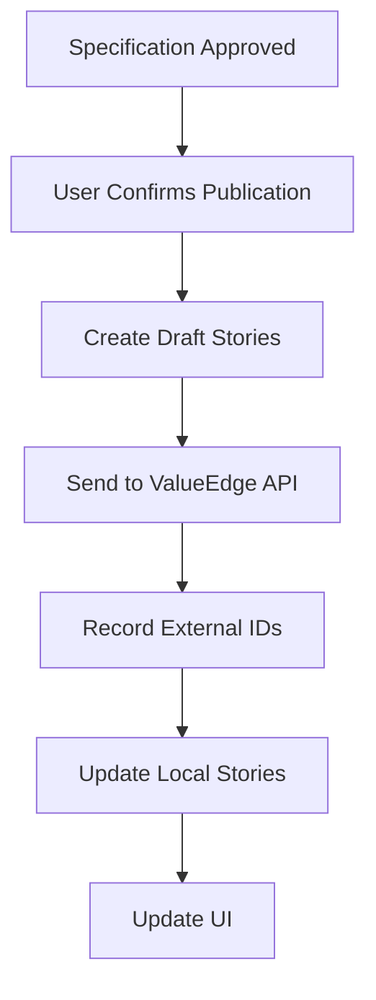

# ValueEdge Feature and Story Integration

Keystone can start an intent-led SDLC from an existing ValueEdge feature and publish the approved small backlog under that feature.

## API Documentation

### Authentication

Keystone uses OAuth 2.0 for authentication with ValueEdge:

```http
POST https://api.valueedge.com/oauth2/token
Content-Type: application/x-www-form-urlencoded

grant_type=client_credentials&client_id=YOUR_CLIENT_ID&client_secret=YOUR_CLIENT_SECRET
```

**Response**:

```json
{
  "access_token": "eyJhbGciOiJIUzI1NiIsInR5cCI6IkpXVCJ9...",
  "token_type": "Bearer",
  "expires_in": 3600,
  "scope": "read write"
}
```

### API Endpoints

#### 1. Get Feature

Retrieve a specific ValueEdge feature.

```http
GET https://api.valueedge.com/features/{featureId}
Authorization: Bearer {access_token}
```

**Request Parameters**:

- `featureId`: ID of the feature to retrieve (required)

**Response**:

```json
{
  "id": "feature:123",
  "title": "Implement User Authentication",
  "description": "Implement user authentication with OAuth2 and JWT",
  "status": "approved",
  "priority": "high",
  "created": "2026-08-01T12:34:56Z",
  "updated": "2026-08-01T12:34:56Z",
  "tags": ["authentication", "security"],
  "epic": "epic:456",
  "project": "project:789",
  "owner": "user:123",
  "assignees": ["user:456", "user:789"],
  "milestone": "milestone:123",
  "dueDate": "2026-09-01T00:00:00Z",
  "customFields": {
    "estimate": "20",
    "storyPoints": "8",
    "team": "backend"
  }
}
```

**Response Fields**:

- `id`: Unique identifier for the feature (required)
- `title`: Title of the feature (required)
- `description`: Detailed description of the feature (required)
- `status`: Status of the feature (proposed, approved, in-progress, completed, rejected) (required)
- `priority`: Priority of the feature (low, medium, high, critical) (required)
- `created`: Timestamp when the feature was created (required)
- `updated`: Timestamp when the feature was last updated (required)
- `tags`: Array of tags associated with the feature (optional)
- `epic`: ID of the epic this feature belongs to (optional)
- `project`: ID of the project this feature belongs to (required)
- `owner`: ID of the owner of the feature (required)
- `assignees`: Array of IDs of assignees (optional)
- `milestone`: ID of the milestone this feature belongs to (optional)
- `dueDate`: Due date for the feature (optional)
- `customFields`: Custom fields for the feature (optional)

#### 2. Get Feature Stories

Retrieve all stories associated with a feature.

```http
GET https://api.valueedge.com/features/{featureId}/stories
Authorization: Bearer {access_token}
```

**Request Parameters**:

- `featureId`: ID of the feature to retrieve stories for (required)

**Response**:

```json
[
  {
    "id": "story:123",
    "title": "Implement Login Page",
    "description": "Implement a login page with username and password fields",
    "status": "approved",
    "priority": "high",
    "created": "2026-08-01T12:34:56Z",
    "updated": "2026-08-01T12:34:56Z",
    "type": "user-story",
    "epic": "epic:456",
    "feature": "feature:123",
    "project": "project:789",
    "owner": "user:123",
    "assignees": ["user:456"],
    "milestone": "milestone:123",
    "dueDate": "2026-08-15T00:00:00Z",
    "acceptanceCriteria": [
      "Login page must have username field",
      "Login page must have password field",
      "Login page must have login button",
      "Login page must validate username and password",
      "Login page must redirect to dashboard on success"
    ],
    "tags": ["ui", "authentication"],
    "customFields": {
      "estimate": "8",
      "storyPoints": "5",
      "team": "frontend"
    }
  }
]
```

**Response Fields**:

- `id`: Unique identifier for the story (required)
- `title`: Title of the story (required)
- `description`: Detailed description of the story (required)
- `status`: Status of the story (proposed, approved, in-progress, completed, rejected) (required)
- `priority`: Priority of the story (low, medium, high, critical) (required)
- `created`: Timestamp when the story was created (required)
- `updated`: Timestamp when the story was last updated (required)
- `type`: Type of story (user-story, quality-story, research, specification, design, development, existing-test-analysis, test-impact-analysis, new-test-creation, failed-test-investigation, flaky-test-analysis, security-review, performance-review, modernization-review, code-review, pr-review, documentation, completion) (required)
- `epic`: ID of the epic this story belongs to (optional)
- `feature`: ID of the feature this story belongs to (required)
- `project`: ID of the project this story belongs to (required)
- `owner`: ID of the owner of the story (required)
- `assignees`: Array of IDs of assignees (optional)
- `milestone`: ID of the milestone this story belongs to (optional)
- `dueDate`: Due date for the story (optional)
- `acceptanceCriteria`: Array of acceptance criteria (required)
- `tags`: Array of tags associated with the story (optional)
- `customFields`: Custom fields for the story (optional)

#### 3. Create Story

Create a new story under a feature.

```http
POST https://api.valueedge.com/features/{featureId}/stories
Authorization: Bearer {access_token}
Content-Type: application/json

{
  "title": "Implement User Registration",
  "description": "Implement a user registration page with email verification",
  "type": "user-story",
  "priority": "high",
  "acceptanceCriteria": [
    "Registration page must have email field",
    "Registration page must have password field",
    "Registration page must have confirm password field",
    "Registration page must validate email format",
    "Registration page must send verification email",
    "Registration page must redirect to login on success"
  ],
  "tags": [
    "ui",
    "authentication"
  ],
  "customFields": {
    "estimate": "12",
    "storyPoints": "8",
    "team": "frontend"
  }
}
```

**Request Parameters**:

- `featureId`: ID of the feature to create the story for (required)

**Request Body**:

- `title`: Title of the story (required)
- `description`: Detailed description of the story (required)
- `type`: Type of story (user-story, quality-story, research, specification, design, development, existing-test-analysis, test-impact-analysis, new-test-creation, failed-test-investigation, flaky-test-analysis, security-review, performance-review, modernization-review, code-review, pr-review, documentation, completion) (required)
- `priority`: Priority of the story (low, medium, high, critical) (required)
- `acceptanceCriteria`: Array of acceptance criteria (required)
- `tags`: Array of tags associated with the story (optional)
- `customFields`: Custom fields for the story (optional)

**Response**:

```json
{
  "id": "story:456",
  "title": "Implement User Registration",
  "description": "Implement a user registration page with email verification",
  "status": "approved",
  "priority": "high",
  "created": "2026-08-01T12:34:56Z",
  "updated": "2026-08-01T12:34:56Z",
  "type": "user-story",
  "epic": "epic:456",
  "feature": "feature:123",
  "project": "project:789",
  "owner": "user:123",
  "assignees": [],
  "milestone": "milestone:123",
  "dueDate": null,
  "acceptanceCriteria": [
    "Registration page must have email field",
    "Registration page must have password field",
    "Registration page must have confirm password field",
    "Registration page must validate email format",
    "Registration page must send verification email",
    "Registration page must redirect to login on success"
  ],
  "tags": ["ui", "authentication"],
  "customFields": {
    "estimate": "12",
    "storyPoints": "8",
    "team": "frontend"
  }
}
```

**Response Fields**:

- `id`: Unique identifier for the story (required)
- `title`: Title of the story (required)
- `description`: Detailed description of the story (required)
- `status`: Status of the story (proposed, approved, in-progress, completed, rejected) (required)
- `priority`: Priority of the story (low, medium, high, critical) (required)
- `created`: Timestamp when the story was created (required)
- `updated`: Timestamp when the story was last updated (required)
- `type`: Type of story (user-story, quality-story, research, specification, design, development, existing-test-analysis, test-impact-analysis, new-test-creation, failed-test-investigation, flaky-test-analysis, security-review, performance-review, modernization-review, code-review, pr-review, documentation, completion) (required)
- `epic`: ID of the epic this story belongs to (optional)
- `feature`: ID of the feature this story belongs to (required)
- `project`: ID of the project this story belongs to (required)
- `owner`: ID of the owner of the story (required)
- `assignees`: Array of IDs of assignees (optional)
- `milestone`: ID of the milestone this story belongs to (optional)
- `dueDate`: Due date for the story (optional)
- `acceptanceCriteria`: Array of acceptance criteria (required)
- `tags`: Array of tags associated with the story (optional)
- `customFields`: Custom fields for the story (optional)

## Import Process

1. **Configure API Credentials**: Configure tenant base URL, shared-space ID, workspace ID, and API client ID in workspace settings.
2. **Store API Secret**: Store the API client secret in VS Code SecretStorage. It is never written under `.keystone`, included in Browser View state, or added to Task Handoff.
3. **Enter Feature ID**: Enter a ValueEdge feature ID and choose **Import Feature**.
4. **Retrieve Feature**: Keystone reads the feature from ValueEdge API.
5. **Create Local Intent**: Keystone creates a local intent based on the feature.
6. **Perform Repository R&D**: Keystone performs deterministic repository research and analysis.
7. **Generate R&D Document**: Keystone generates a presentable R&D document.
8. **Create Backlog**: Keystone creates small user and quality stories from the R&D document.
9. **Generate SDLC Plan**: Keystone generates the full 16-story executable SDLC state machine.

## Planning Process

The approved local plan contains:

- A presentable R&D document
- Small user stories derived from affected APIs, services, data entities, symbols, and repository slices
- Quality stories derived from mapped/missing tests, security and performance risk, engineering review, and read-only PR review
- The full 16-story executable SDLC state machine

The local SDLC and its evidence remain authoritative while work is in progress.

## Publication Process

After explicit specification approval, generated backlog stories become approved. The user must confirm publication. Keystone then creates draft user and quality stories under the imported feature and records returned external IDs. It does not update unrelated ValueEdge entities or publish unapproved stories.

### Publication Workflow



### Publication Details

1. **Specification Approved**: The user approves the specification
2. **User Confirms Publication**: The user explicitly confirms publication
3. **Create Draft Stories**: Keystone creates draft stories from approved backlog
4. **Send to ValueEdge API**: Keystone sends draft stories to ValueEdge API
5. **Record External IDs**: Keystone records the external IDs returned by ValueEdge
6. **Update Local Stories**: Keystone updates local stories with external IDs
7. **Update UI**: Keystone updates the UI with publication status

### API Integration

Keystone integrates with ValueEdge through:

1. **Authentication**: OAuth 2.0 client credentials flow
2. **Data Sync**: Two-way sync of features and stories
3. **Status Sync**: Sync of status changes
4. **Change Tracking**: Tracking of changes between systems
5. **Conflict Resolution**: Resolving conflicts between systems

### Data Mapping

Keystone maps ValueEdge entities to Keystone entities:

| ValueEdge           | Keystone                  |
| ------------------- | ------------------------- |
| Feature             | Intent                    |
| Story               | Backlog Story             |
| Status              | Story Status              |
| Priority            | Story Priority            |
| Tags                | Story Tags                |
| Custom Fields       | Story Metadata            |
| Epic                | Project                   |
| Project             | Project                   |
| Owner               | Story Owner               |
| Assignees           | Story Assignees           |
| Milestone           | Milestone                 |
| Due Date            | Story Due Date            |
| Acceptance Criteria | Story Acceptance Criteria |

### Error Handling

Keystone handles API errors gracefully:

1. **Authentication Errors**: Handle invalid credentials
2. **Network Errors**: Handle connectivity issues
3. **API Errors**: Handle API errors and rate limiting
4. **Data Errors**: Handle invalid data
5. **Conflict Errors**: Handle conflicts between systems

### Security

Keystone ensures security in the integration:

1. **Secret Storage**: API secret is stored in VS Code SecretStorage
2. **No Persistent Storage**: API secret is never written to disk
3. **No Browser Storage**: API secret is not included in Browser View state
4. **No Task Handoff**: API secret is not added to Task Handoff
5. **HTTPS Only**: All communication is over HTTPS
6. **Token Expiration**: Access tokens expire and are refreshed
7. **Scope Limitation**: API access is limited to required scopes

The ValueEdge integration allows Keystone to seamlessly integrate with existing workflow systems while maintaining its local-first, intelligence-driven approach.

## Gap Analysis References

The following gaps identified in [GAP_ANALYSIS.md](./GAP_ANALYSIS.md) affect the ValueEdge integration:

| Gap       | Title                                                                                                              | Impact on ValueEdge Integration                                                                                | Implementation Plan                                                                    |
| --------- | ------------------------------------------------------------------------------------------------------------------ | -------------------------------------------------------------------------------------------------------------- | -------------------------------------------------------------------------------------- |
| **Gap 1** | [Continuation Packets for Long-Running Tasks](./GAP_ANALYSIS.md#gap-1-continuation-packets-for-long-running-tasks) | Large feature/story imports or publications may exceed payload limits; continuation packets enable streaming   | [Plan 1](./IMPLEMENTATION_PLANS.md#plan-1-continuation-packets-for-long-running-tasks) |
| **Gap 2** | [Context Compression Caching](./GAP_ANALYSIS.md#gap-2-context-compression-caching)                                 | Compressed R&D documents and intelligence context for ValueEdge features could benefit from persistent caching | [Plan 2](./IMPLEMENTATION_PLANS.md#plan-2-context-compression-caching)                 |
| **Gap 3** | [Query Result Caching](./GAP_ANALYSIS.md#gap-3-query-result-caching)                                               | Intelligence queries for feature analysis could be cached for faster import/planning                           | [Plan 3](./IMPLEMENTATION_PLANS.md#plan-3-query-result-caching)                        |
| **Gap 4** | [Adaptive-Segments Delivery Mode](./GAP_ANALYSIS.md#gap-4-adaptive-segments-delivery-mode)                         | Large feature intelligence data could use adaptive segmentation for progressive disclosure                     | [Plan 4](./IMPLEMENTATION_PLANS.md#plan-4-adaptive-segments-delivery-mode)             |
| **Gap 5** | [File Hash Caching Persistence](./GAP_ANALYSIS.md#gap-5-file-hash-caching-persistence)                             | File hashes for repository analysis during import could be cached persistently                                 | [Plan 5](./IMPLEMENTATION_PLANS.md#plan-5-file-hash-caching-persistence)               |
| **Gap 6** | [Extraction Result Caching Persistence](./GAP_ANALYSIS.md#gap-6-extraction-result-caching-persistence)             | Intelligence extraction results for feature analysis could be cached to avoid re-extraction                    | [Plan 6](./IMPLEMENTATION_PLANS.md#plan-6-extraction-result-caching-persistence)       |
| **Gap 7** | [Projection Caching Persistence](./GAP_ANALYSIS.md#gap-7-projection-caching-persistence)                           | Graph/search/CPG projections for feature analysis could be cached for faster planning                          | [Plan 7](./IMPLEMENTATION_PLANS.md#plan-7-projection-caching-persistence)              |
